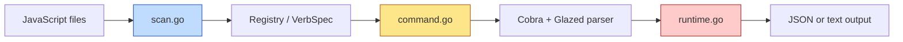

# Playbook: Adding jsverbs to Arbitrary Go Glazed Tools

This note is a reusable playbook for taking an existing Go + Glazed CLI and adding `jsverbs` support so JavaScript functions can be scanned, described as commands, and invoked through a normal Cobra/Glazed command tree. The concrete reference implementation is `go-go-goja`, with additional operational lessons borrowed from `loupedeck` and from the Discord bot project at `/home/manuel/code/wesen/2026-04-20--js-discord-bot`.

> [!summary]
> This pattern has four important rules:
> 1. keep `jsverbs` as a **pipeline** (`scan -> describe -> invoke`), not as a bag of helpers
> 2. put CLI-specific orchestration in a **host package**, not inside `pkg/jsverbs`
> 3. make help and execution share the **same `CommandDescriptionForVerb(...)` source**
> 4. treat JavaScript verb repositories as **explicitly scanned inputs**, not magical runtime state

## Why this note exists

Once a Go CLI already uses Glazed and Cobra, adding JavaScript-defined verbs is surprisingly tractable — but only if you preserve the boundaries that the reference implementation already discovered.

The most common mistake is to mix three different concerns into one layer:

- JavaScript source discovery
- Glazed command construction
- runtime invocation and lifecycle ownership

`go-go-goja` shows that these should be separate:

- `pkg/jsverbs/scan.go` discovers source files and metadata
- `pkg/jsverbs/command.go` turns discovered verbs into Glazed descriptions/wrappers
- `pkg/jsverbs/runtime.go` invokes a selected function inside a Goja runtime
- the host application adds the CLI surface and repository conventions around that

That separation is the core thing worth reusing.

## When to use this pattern

Use this pattern when:

- your application already has a Glazed/Cobra command tree
- you want to let users or operators add small JavaScript commands without recompiling Go
- you want command help, flags, arguments, and runtime invocation to be generated from JavaScript metadata
- you are comfortable embedding a Goja runtime in the host application

Do **not** use this pattern when:

- you only need one hard-coded JavaScript script and no command discovery
- you want long-lived plugin protocols with isolation or process boundaries
- your real need is a runtime bot DSL rather than CLI verbs
- you are not willing to treat JavaScript repositories as explicit user-provided inputs

## Core mental model

The best mental model is:

```text
JavaScript source is scanned first,
compiled into Glazed command descriptions second,
and only executed after the selected command has been parsed.
```

That order matters.

A `jsverbs`-enabled app is **not** “a JavaScript runtime with some CLI glue.” It is a command-construction pipeline:



If you keep that mental model, the design decisions become much easier:

- scanning should not need a live runtime
- help text should be built from the same metadata as parsing
- runtime invocation should happen only after the command shape is known
- host apps can add their own CLI UX without changing the generic scanner/runtime packages

## Architecture

A reusable host-side layout looks like this:

```text
myapp/
├── cmd/myapp/main.go              # root Cobra/Glazed CLI
├── pkg/jsfeature/                 # host-specific jsverbs orchestration
│   ├── bootstrap.go              # repository discovery and validation
│   ├── command.go                # `verbs` / `bots` / `scripts` command surface
│   ├── resolve.go                # selector resolution
│   ├── runtime.go                # ephemeral runtime-backed command execution
│   └── model.go                  # host-side repository/discovered-verb structs
└── vendor or module dependency
    └── github.com/go-go-golems/go-go-goja/pkg/jsverbs
```

The generic `pkg/jsverbs` package should stay reusable. Your application-specific command names, repository flags, and policy choices should live in your own package.

## Reference implementation map

### In `go-go-goja`

Key files:

- `/home/manuel/code/wesen/corporate-headquarters/go-go-goja/pkg/jsverbs/scan.go`
- `/home/manuel/code/wesen/corporate-headquarters/go-go-goja/pkg/jsverbs/model.go`
- `/home/manuel/code/wesen/corporate-headquarters/go-go-goja/pkg/jsverbs/command.go`
- `/home/manuel/code/wesen/corporate-headquarters/go-go-goja/pkg/jsverbs/runtime.go`
- `/home/manuel/code/wesen/corporate-headquarters/go-go-goja/cmd/jsverbs-example/main.go`
- `/home/manuel/code/wesen/corporate-headquarters/go-go-goja/cmd/go-go-goja/main.go`
- `/home/manuel/code/wesen/corporate-headquarters/go-go-goja/pkg/botcli/bootstrap.go`
- `/home/manuel/code/wesen/corporate-headquarters/go-go-goja/pkg/botcli/command.go`
- `/home/manuel/code/wesen/corporate-headquarters/go-go-goja/pkg/botcli/runtime.go`

### In `loupedeck`

Good advanced references:

- `/home/manuel/code/wesen/corporate-headquarters/loupedeck/cmd/loupedeck/cmds/verbs/bootstrap.go`
- `/home/manuel/code/wesen/corporate-headquarters/loupedeck/cmd/loupedeck/cmds/verbs/command.go`
- `/home/manuel/code/wesen/corporate-headquarters/loupedeck/pkg/scriptmeta/scriptmeta.go`

Use `go-go-goja` for the simplest clear implementation and `loupedeck` for the richer operational patterns.

## Step-by-step implementation sequence

## 1. Start with a normal Glazed root command

Your host app should already have a root command that does logging and help setup.

Minimal pattern:

```go
root := &cobra.Command{
    Use: "myapp",
    PersistentPreRunE: func(cmd *cobra.Command, args []string) error {
        return logging.InitLoggerFromCobra(cmd)
    },
}

_ = logging.AddLoggingSectionToRootCommand(root, "myapp")
helpSystem := help.NewHelpSystem()
help_cmd.SetupCobraRootCommand(helpSystem, root)
```

This part matters because you do **not** want your JavaScript integration to become a parallel CLI architecture. It should fit into the same help/logging model as the rest of the tool.

## 2. Decide on the public command surface first

Before you write any runtime glue, choose the user-facing UX.

Common options:

- `myapp verbs <verb> ...`
- `myapp scripts <verb> ...`
- `myapp bots list|run|help`
- `myapp js list|run|help`

The command surface determines how much dynamic command construction you need.

Two good patterns:

### Pattern A: dynamic subcommands

This is the `loupedeck verbs` style:

```text
myapp verbs document configure
myapp verbs alerts ping
```

Good when you want verbs to feel like first-class subcommands.

### Pattern B: stable action commands

This is the newer `go-go-goja bots` style:

```text
myapp bots list
myapp bots run alerts ping
myapp bots help alerts ping
```

Good when you want a stable shell-facing contract and easier wrapping.

## 3. Add host-side repository bootstrap

Your application needs to decide where JavaScript repositories come from.

The minimum useful version is a repeatable flag:

```go
root.PersistentFlags().StringArray("bot-repository", nil, "Directory to scan for JavaScript verbs")
```

Then normalize and validate those paths.

Pseudocode:

```go
func repositoriesFromCLIPaths(paths []string, cwd string) ([]Repository, error) {
    for _, raw := range paths {
        normalized := normalizePath(raw, cwd)
        stat(normalized)
        ensureDirectory(normalized)
        append(Repository{Name: basename(normalized), RootDir: normalized})
    }
}
```

Working rules:

- trim whitespace
- expand `~/`
- resolve relative paths against `cwd`
- reject non-directories
- deduplicate by cleaned absolute path

If the application later needs config/env support, copy the richer `loupedeck` bootstrap model.

## 4. Scan repositories explicitly

The host orchestration layer should call `jsverbs.ScanDir(...)` itself.

Recommended v1 policy:

```go
opts := jsverbs.DefaultScanOptions()
opts.IncludePublicFunctions = false
registry, err := jsverbs.ScanDir(repo.RootDir, opts)
```

That explicit `IncludePublicFunctions = false` is an important policy choice. It means only functions annotated with `__verb__(...)` are exposed. This is usually the safer production default.

Why explicit verbs are better in host applications:

- fewer accidental command exposures
- clearer review surface
- easier operator mental model
- better long-term stability when JS files grow helper functions

## 5. Build host-side discovered-command structs

The generic `Registry` knows about verbs, but your host app usually needs more context.

Typical host-side structs:

```go
type Repository struct {
    Name      string
    Source    string
    SourceRef string
    RootDir   string
}

type ScannedRepository struct {
    Repository Repository
    Registry   *jsverbs.Registry
}

type DiscoveredVerb struct {
    Repository ScannedRepository
    Verb       *jsverbs.VerbSpec
}
```

These types are where you store things like:

- repository origin
- source labels for duplicate errors
- root directory for module resolution

## 6. Fail loudly on duplicate full paths

Once you scan more than one repository, duplicate path handling becomes critical.

Always detect duplicates by `VerbSpec.FullPath()`.

Pseudocode:

```go
seen := map[string]DiscoveredVerb{}
for _, repo := range repos {
    for _, verb := range repo.Registry.Verbs() {
        key := verb.FullPath()
        if prev, ok := seen[key]; ok {
            return error("duplicate verb path", key, prev, current)
        }
        seen[key] = current
    }
}
```

This is not optional. Silently picking one repository is a dangerous operator surprise.

## 7. Reuse `CommandDescriptionForVerb(...)` for both help and run

This is one of the most important implementation rules.

Do **not** invent one path for help and another for execution.

Instead:

```go
description, err := registry.CommandDescriptionForVerb(verb)
```

and then use that same description to:

- build the Cobra command shown by `help`
- build the parser used by `run`

This prevents help drift and parsing drift.

## 8. Build ephemeral verb-specific Cobra commands

If your public surface is `run <verb>` or `help <verb>`, you usually need to build a temporary Cobra command after the selector is known.

Pseudocode:

```go
cmd := glazedcli.NewCobraCommandFromCommandDescription(description)
parser := glazedcli.NewCobraParserFromSections(description.Schema, &glazedcli.CobraParserConfig{
    SkipCommandSettingsSection: true,
})
_ = parser.AddToCobraCommand(cmd)
```

Then either:

- `cmd.Help()` for help flow
- `parser.Parse(cmd, args)` for run flow

That is the cleanest way to keep the command truly verb-specific without hard-coding flag definitions in Go.

## 9. Compose the runtime explicitly

A good host integration should create a Goja runtime with:

- the scanned-source overlay loader
- module roots or global folders
- the default registry modules

The overlay loader is critical:

```go
engine.WithRequireOptions(require.WithLoader(registry.RequireLoader()))
```

Filesystem module roots are also critical if your JS files use relative `require()` or local `node_modules`:

```go
engine.WithRequireOptions(require.WithGlobalFolders(rootDir, filepath.Join(rootDir, "node_modules")))
```

Minimal composition sketch:

```go
factory, err := engine.NewBuilder(
    engine.WithRequireOptions(require.WithLoader(registry.RequireLoader())),
    engine.WithRequireOptions(require.WithGlobalFolders(rootDir, filepath.Join(rootDir, "node_modules"))),
).
    WithModules(engine.DefaultRegistryModules()).
    Build()
```

## 10. Invoke through `registry.InvokeInRuntime(...)`

Once values are parsed, runtime invocation should stay inside the generic `jsverbs` package.

```go
result, err := registry.InvokeInRuntime(ctx, runtime, verb, parsedValues)
```

That gives you:

- argument marshalling
- source-module loading
- function lookup via the injected verb registry
- Promise settlement

Do not reimplement argument mapping in the host app unless you are deliberately extending the generic model.

## 11. Print structured and text outputs separately

`jsverbs` verbs can return either:

- structured data
- text output

The host app needs to respect `verb.OutputMode`.

A reasonable v1 printer is:

- `text` -> write strings/bytes/plain values directly
- default -> JSON-encode the result

If your host app later wants richer Glazed renderers, you can add them after the base path works.

## 12. Add authoring docs and real examples

The integration is not complete until users know how to write scripts.

At minimum, document:

- that verbs are explicit `__verb__(...)` declarations
- how paths are formed from directories + filenames + verb names
- how `output: "text"` works
- how async functions behave
- how relative `require()` works

Also add a realistic example repository, not just micro-fixtures.

## Pseudocode for the full host flow

```text
start root command
  -> parse host-level flags
  -> discover repository paths
  -> scan repositories with jsverbs.ScanDir
  -> collect discovered verbs
  -> resolve requested selector
  -> build CommandDescriptionForVerb
  -> build ephemeral Cobra command + parser
  -> parse verb-specific args
  -> create Goja runtime with overlay loader + module roots
  -> registry.InvokeInRuntime
  -> print result
```

```go
func runSelectedVerb(ctx context.Context, selector string, rawArgs []string) error {
    bootstrap := DiscoverBootstrap(...)
    scanned := ScanRepositories(bootstrap)
    discovered := CollectDiscoveredVerbs(scanned)
    target := ResolveVerb(selector, discovered)

    desc := target.Repository.Registry.CommandDescriptionForVerb(target.Verb)
    verbCmd := buildEphemeralVerbCommand(desc)
    parsed := parseVerbArgs(verbCmd, rawArgs)

    runtime := buildRuntime(target.Repository)
    defer runtime.Close(context.Background())

    result := target.Repository.Registry.InvokeInRuntime(ctx, runtime, target.Verb, parsed)
    return printResult(target.Verb.OutputMode, result)
}
```

## Common failure modes

## 1. The scanner finds nothing

Cause:

- `IncludePublicFunctions = false` plus missing `__verb__(...)`

Symptom:

- `list` is empty even though JS files exist

Fix:

- add explicit `__verb__(...)` metadata
- or, if appropriate, intentionally enable public-function inference

## 2. Help and run drift apart

Cause:

- help builds one schema path; run builds another

Fix:

- always use `CommandDescriptionForVerb(...)` for both

## 3. Relative `require()` fails at runtime

Cause:

- runtime was built without overlay loader or module roots

Fix:

- include `registry.RequireLoader()` and filesystem module roots/global folders

## 4. Promise-returning verbs print raw runtime objects

Cause:

- host app bypassed `InvokeInRuntime(...)`

Fix:

- let `pkg/jsverbs/runtime.go` own invocation and Promise settlement

## 5. Duplicate verbs across repositories produce surprising behavior

Cause:

- host app failed to detect duplicate `FullPath()` values

Fix:

- fail loudly during discovery

## Anti-patterns

Avoid these:

- putting host UX rules into `pkg/jsverbs`
- skipping duplicate detection
- treating JS source as runtime-only instead of scan-first metadata
- hand-parsing verb-specific flags in Go
- building a help path separate from the execution path
- assuming long-lived runtime bot DSLs and CLI verbs are the same abstraction

## Recommended implementation checklist

1. add a host-side orchestration package
2. choose the public UX (`verbs`, `bots`, `scripts`, etc.)
3. add repository flags and normalization
4. scan with explicit policy (`IncludePublicFunctions` on/off)
5. collect and dedupe discovered verbs
6. resolve selectors
7. reuse `CommandDescriptionForVerb(...)`
8. build ephemeral verb-specific Cobra commands
9. compose a runtime explicitly
10. invoke via `InvokeInRuntime(...)`
11. print structured/text results correctly
12. ship examples and authoring docs

## Working rules

> [!important]
> Treat `jsverbs` as a compile-and-run pipeline, not as a loose helper library.

> [!important]
> Keep host CLI policy in the host application.

> [!important]
> Make help and execution share one verb description source.

## Related notes

- [[PROJ - JS Discord Bot - Building a Discord Bot with a JavaScript API]]
- [[PROJ - JS Discord Bot - Adding jsverbs Support]]
