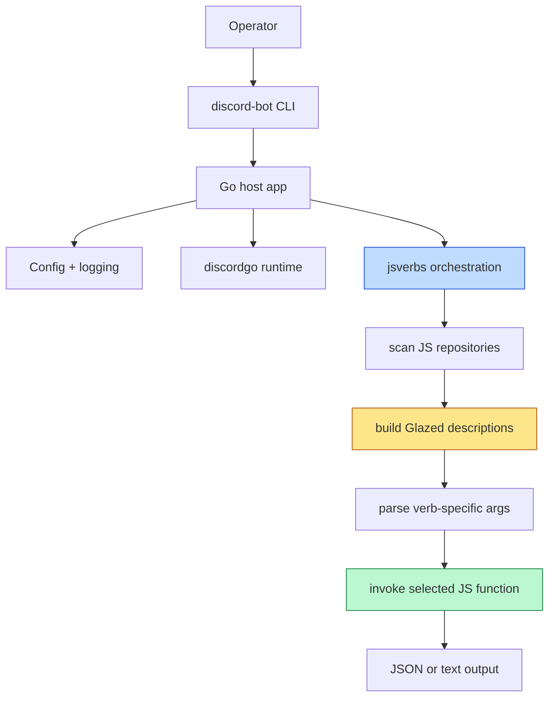

# JS Discord Bot — Adding jsverbs Support

This project report captures the next major phase after the bot has a JavaScript host API: adding `jsverbs` so JavaScript-authored bot utilities can be scanned and exposed as CLI verbs. The key idea is that the JavaScript API and `jsverbs` solve related but different problems. The JS API is about runtime behavior inside the bot. `jsverbs` is about turning JavaScript functions into discoverable command-line operations.

> [!summary]
> Adding `jsverbs` support to the Discord bot is valuable for three reasons:
> 1. it gives the bot a **scriptable operational CLI** without recompiling Go
> 2. it keeps JavaScript behavior **discoverable** through help text and command schemas
> 3. it separates **long-lived bot runtime behavior** from **short-lived operator workflows** like admin, testing, and maintenance

## Why this project exists

Once a Discord bot has a JavaScript API, the next natural request is usually: “How do I run or test pieces of bot behavior from the command line?”

That is exactly where `jsverbs` fits.

Examples of useful Discord-bot-adjacent CLI verbs:

- inspect a repository of bot scripts
- run one command handler in isolation against sample inputs
- preview structured response payloads
- run small maintenance operations or sync helpers
- test transformation logic without needing a live gateway connection

These are CLI-oriented workflows, not necessarily long-lived gateway workflows. `jsverbs` gives them a stable, schema-driven command surface.

## Current project status

Current `js-discord-bot` repository status:

- Go bot host exists.
- No Goja runtime exists in this repo yet.
- No JS API exists in this repo yet.
- No `jsverbs` integration exists in this repo yet.

So this note describes a **planned phase**, not a completed feature.

The most relevant reference implementation lives in:

- `/home/manuel/code/wesen/corporate-headquarters/go-go-goja`

Specifically:

- `pkg/jsverbs/scan.go`
- `pkg/jsverbs/command.go`
- `pkg/jsverbs/runtime.go`
- `cmd/go-go-goja/main.go`
- `pkg/botcli/`
- `examples/bots/`

## Why `jsverbs` and JS API are different

This distinction is the most important architectural point in the whole project.

### JavaScript host API

The JS API answers:

> “How does a bot script interact with the live Discord runtime?”

That includes things like:

- command registration
- interaction handling
- replying to Discord users
- reacting to ready/message/interaction events

### jsverbs

`jsverbs` answers:

> “How does a JavaScript function become a CLI command?”

That includes:

- scanning files
- building Glazed command descriptions
- parsing flags and arguments
- invoking a selected JS function in a Goja runtime
- rendering structured or text output

These are connected, but not identical.

## Recommended product shape

The Discord bot should eventually have two JavaScript-facing surfaces.

### Surface 1: runtime JS bot API

Examples:

```text
discord-bot run --script ./bot/main.js
```

This is the live gateway-facing mode.

### Surface 2: CLI jsverbs support

Examples:

```text
discord-bot verbs list --verb-repository ./scripts
discord-bot verbs run alerts ping --verb-repository ./scripts
discord-bot verbs help alerts ping --verb-repository ./scripts
```

or, if the team prefers the newer stable-action shape:

```text
discord-bot bots list --bot-repository ./scripts
discord-bot bots run alerts ping --bot-repository ./scripts
discord-bot bots help alerts ping --bot-repository ./scripts
```

Either shape can work. The stable-action `list|run|help` surface is usually easier to explain and script.

## Project shape

A good final shape for the Discord bot repo would be:

```text
js-discord-bot/
├── cmd/discord-bot/
│   ├── main.go
│   ├── root.go
│   ├── commands.go                  # existing Go host commands
│   └── jsverbs.go or bots.go        # new jsverbs surface
├── internal/bot/                    # existing Discord host runtime
├── internal/config/                 # existing config loader
├── internal/jsruntime/              # future Goja host wiring
├── internal/jsdiscord/              # future Discord runtime module / bridge
├── internal/jsverbscli/             # host-side jsverbs orchestration
└── scripts/ or examples/bots/       # actual JS verb repositories
```

The important rule is that the generic `jsverbs` pipeline stays external, and the repository-specific UX lives in a local orchestration package.

## Architecture



The Discord session does **not** need to be live for every CLI verb. Many verbs can run in a caller-owned runtime that has Discord-related helper modules but no gateway connection.

## Implementation details

## What should be reused directly

From `go-go-goja`, reuse the generic pieces conceptually or as dependencies:

- `jsverbs.ScanDir(...)`
- `Registry.CommandDescriptionForVerb(...)`
- `Registry.InvokeInRuntime(...)`
- explicit runtime composition through `engine.NewBuilder(...)`

From the newer host-side pattern, reuse these design ideas:

- host-side bootstrap package
- repository normalization and validation
- duplicate full-path detection
- stable `list|run|help` command surface
- ephemeral verb-specific Cobra command for help and parsing

## What should remain application-specific

The Discord bot should own:

- command naming
- repository flags (`--verb-repository` or `--bot-repository`)
- any runtime module that exposes Discord-specific helpers to JS
- any integration between live bot state and CLI verbs

## Recommended CLI sequence

A safe implementation sequence looks like this:

### Phase 1: add a separate `verbs` or `bots` command group

Do not mix this directly into the existing `run` implementation.

### Phase 2: support scanning one or more JS repositories

Start with a repeatable CLI flag only.

### Phase 3: choose explicit-verb-only discovery

Use:

```go
opts := jsverbs.DefaultScanOptions()
opts.IncludePublicFunctions = false
```

That means CLI-exposed JS commands are always opt-in via `__verb__(...)`.

### Phase 4: add `list`

This is the easiest validation path and immediately proves discovery.

### Phase 5: add `run <verb>`

Resolve a selector, build one verb-specific parser, invoke the selected function, and print the result.

### Phase 6: add `help <verb>`

Reuse the same description source as `run`.

## Pseudocode for the host integration

```text
discord-bot bots run alerts ping --bot-repository ./scripts --channel ops
  -> scan repositories with jsverbs.ScanDir
  -> resolve selector alerts ping
  -> build CommandDescriptionForVerb
  -> parse remaining args with an ephemeral Cobra command
  -> build Goja runtime
  -> optionally register Discord helper modules
  -> invoke the selected function
  -> print JSON/text output
```

```go
func runSelectedVerb(ctx context.Context, selector string, args []string) error {
    bootstrap := discoverVerbRepositories()
    scanned := scanRepositories(bootstrap)
    discovered := collectDiscoveredVerbs(scanned)
    target := resolveVerb(selector, discovered)

    desc := target.Registry.CommandDescriptionForVerb(target.Verb)
    cmd, parser := buildEphemeralVerbCommand(desc)
    parsed := parser.Parse(cmd, args)

    rt := buildRuntime(target)
    defer rt.Close(context.Background())

    result := target.Registry.InvokeInRuntime(ctx, rt, target.Verb, parsed)
    return printResult(target.Verb.OutputMode, result)
}
```

## What kinds of verbs are actually useful here?

A Discord bot repo can benefit from several classes of JS verbs.

### 1. Response-preview verbs

These let you run command logic against sample inputs and inspect the output shape without Discord being involved.

### 2. Maintenance/admin verbs

Examples:

- list configured commands
- preview sync payloads
- inspect guild-local config transforms
- generate docs or examples

### 3. Bot logic smoke verbs

A JS command implementation can often be tested as a plain function if it is designed around data in / data out.

## Relationship to the runtime JS API

The cleanest relationship is:

- runtime JS API for live gateway behavior
- `jsverbs` for offline or operator-driven command workflows

In some cases a `jsverbs` script may wrap the runtime bot module. That is fine. But the scanner should still discover explicit top-level verbs, not try to infer them from runtime bot registration.

## Risks and failure modes

### 1. Trying to make runtime bot registration equal CLI command discovery

This is the biggest design trap.

A long-lived bot DSL is not automatically a CLI verb system. Keep them separate unless there is a very deliberate adapter layer.

### 2. Over-coupling JS command schemas to Discord runtime details

Some CLI verbs should work without a live session. If every JS verb assumes a connected gateway, the CLI becomes much less useful.

### 3. Hiding duplicate script paths across multiple repositories

As soon as multiple repositories are supported, duplicate detection becomes operationally important.

## Near-term next steps

- first add the JS host runtime to the bot project
- then add a minimal `verbs` or `bots` command group
- start with repository scanning + `list`
- only after that add `run` and `help`
- finally add a small example repository of Discord-bot-specific jsverbs

## Project working rule

> [!important]
> Treat runtime bot behavior and CLI jsverbs as two separate JavaScript surfaces. Reuse the same Goja foundation, but do not force them into one abstraction too early.

## Related notes

- [[ARTICLE - Playbook - Adding jsverbs to Arbitrary Go Glazed Tools]]
- [[PROJ - JS Discord Bot - Building a Discord Bot with a JavaScript API]]
