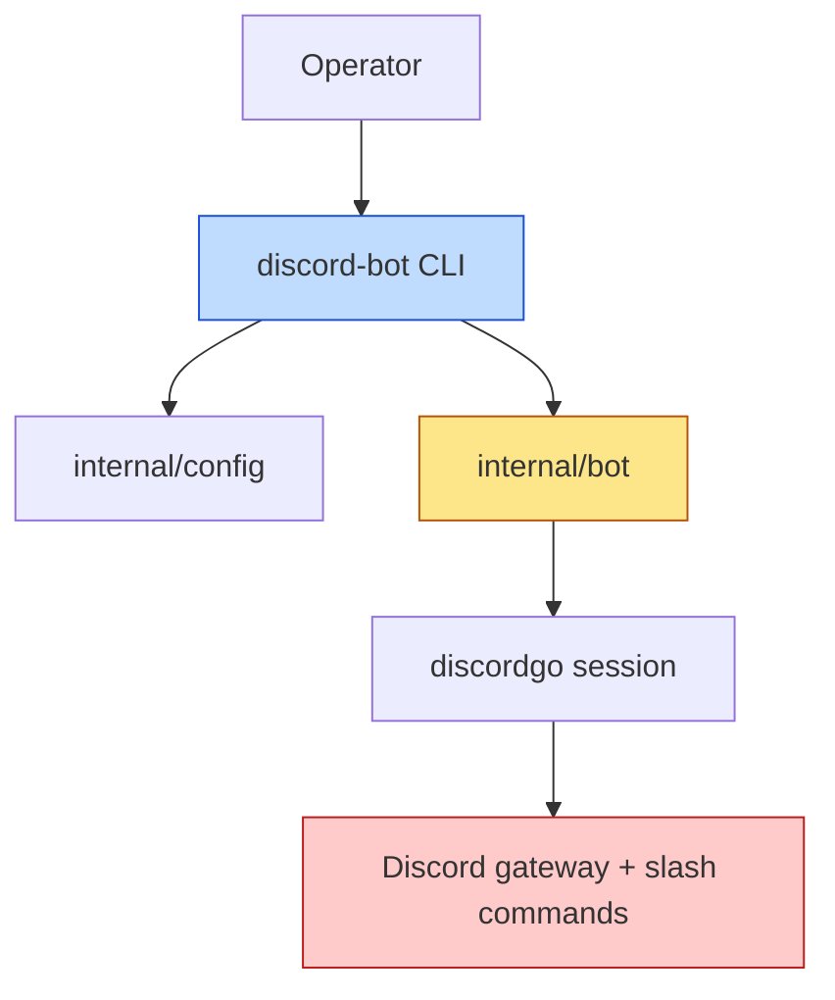

# JS Discord Bot

This project starts as a small Go Discord bot with a Glazed CLI and then evolves toward a host-managed JavaScript API so bot behavior can be authored in JS instead of being hard-coded only in Go. The current repository already has the right first layer — CLI commands, config handling, Discord session lifecycle, slash-command sync, and simple handlers — which makes it a good base for a JavaScript host runtime rather than a greenfield rewrite.

> [!summary]
> The project now has two distinct phases:
> 1. a **working Go Discord bot** with Glazed-based operational commands
> 2. a **planned Goja-hosted JavaScript API layer** that would move bot logic from static Go handlers into JS-authored behavior

## Why this project exists

The first version of the bot was intentionally conservative. It proves the operational basics:

- a Glazed root CLI
- environment-based Discord credentials
- guild-scoped slash-command sync for development
- a long-lived bot runtime process
- simple `/ping` and `/echo` interactions

That is the right foundation for a later JavaScript API because it keeps the critical host concerns already solved in Go:

- process lifecycle
- signal handling
- token management
- Discord gateway ownership
- slash-command registration

Once those are stable, the next useful move is **not** to replace Go. The next useful move is to let Go own the runtime and Discord session while JS owns more of the bot behavior.

## Current project status

Current repo state at `/home/manuel/code/wesen/2026-04-20--js-discord-bot`:

- Glazed/Cobra root command exists in:
  - `cmd/discord-bot/root.go`
  - `cmd/discord-bot/commands.go`
  - `cmd/discord-bot/main.go`
- Discord config loading exists in:
  - `internal/config/config.go`
- Discord runtime/session lifecycle exists in:
  - `internal/bot/bot.go`
- Bot behavior is still implemented in Go, not JavaScript.
- There is currently **no embedded Goja runtime**, **no JS host module**, and **no jsverbs integration** in this repo yet.

So the project is in a healthy “host-first” shape, but still pre-JS-API.

## Project shape

Right now the project has three layers:

1. **CLI layer**
   - parse flags and environment
   - expose `run`, `sync-commands`, and `validate-config`
2. **Discord host layer**
   - own the Discord session
   - sync application commands
   - receive interactions and reply
3. **Future JavaScript behavior layer**
   - embed Goja runtime
   - expose Discord host capabilities to JS
   - load bot logic from scripts or script repositories

The key architectural insight is that the future JS API should be an **additional layer**, not a rewrite of the first two layers.

## Architecture

### Current architecture



### Target architecture with JS API

```mermaid
flowchart TD
    User[Operator] --> CLI[discord-bot CLI]
    CLI --> HOST[Go host runtime]
    HOST --> DG[discordgo session]
    HOST --> JSRT[Goja runtime]
    JSRT --> JSMOD[require("discord") or require("sandbox")]
    JSMOD --> Script[JS bot script]
    DG --> Discord[Discord gateway]
    Discord --> HOST
    HOST --> Script

    style JSRT fill:#bfdbfe,stroke:#1d4ed8
    style JSMOD fill:#fde68a,stroke:#b45309
    style Script fill:#bbf7d0,stroke:#15803d
```

In that model:

- Go still owns the Discord session.
- Go still owns process lifecycle and secrets.
- JS receives a capability-based API for defining behavior.
- Event dispatch crosses from Go into JS, but Discord socket ownership stays in Go.

## Current commands

The current user-facing commands are:

```text
discord-bot run
discord-bot validate-config
discord-bot sync-commands
```

These are good host commands even after a JS API is added. They should remain the operational shell around the future JS runtime.

## Implementation details

## What already exists in Go

The current `commands.go` file already defines a strong host boundary.

- `validate-config` proves secrets and IDs exist before runtime work begins.
- `sync-commands` updates Discord-side slash command definitions.
- `run` opens the bot session and blocks until shutdown.

That means the first JavaScript integration should **not** start by changing command structure. It should start by changing what `run` loads and dispatches.

Pseudocode for the existing host shape:

```text
run command
  -> decode config
  -> validate config
  -> create bot host
  -> open Discord session
  -> block until context cancel
```

A JS-hosted shape would become:

```text
run command
  -> decode config
  -> validate config
  -> create bot host
  -> build Goja runtime
  -> register runtime modules
  -> load JS bot script
  -> sync or inspect declared commands
  -> open Discord session
  -> dispatch interactions/events into JS handlers
  -> block until context cancel
```

## Two reasonable JS API shapes

### Option A: dedicated Discord host module

Expose something like:

```js
const discord = require("discord")

discord.command("ping", async (ctx) => {
  return { content: "pong" }
})

discord.command("echo", async (ctx) => {
  return { content: ctx.options.text }
})
```

Good properties:

- clear domain naming
- direct mapping to Discord concepts
- easy to grow with reply/edit/defer APIs

### Option B: sandbox-style declarative bot API

Reuse the newer `go-go-goja` sandbox pattern:

```js
const { defineBot } = require("sandbox")

module.exports = defineBot(({ command, event, configure }) => {
  configure({ name: "discord-bot" })

  command("ping", async (ctx) => {
    return { content: "pong" }
  })

  event("ready", async (ctx) => {
    return { log: "connected" }
  })
})
```

Good properties:

- capability-based runtime model
- clear split between host and script
- easy to test/dispatch from Go

For this project, the sandbox shape is attractive because it already exists conceptually in `go-go-goja` and is a better long-term abstraction than inventing a Discord-specific JS API from scratch.

## Recommended host-side boundary

The strongest boundary is:

- **Go owns**
  - token/config loading
  - Discord session connection
  - command sync API calls
  - event collection
  - shutdown behavior
- **JS owns**
  - command behavior
  - response shaping
  - event-side logic
  - small local state

That boundary prevents several messy failure modes:

- JS code never directly handles secrets management.
- JS code does not own socket lifecycle.
- Go does not need to know every future bot behavior in advance.

## Practical implementation sequence

### Phase 1: embed Goja without changing the current bot behavior

Add a Goja runtime to the process and prove the host can load a script.

### Phase 2: expose a minimal host module

Start with a tiny runtime module that can:

- register commands
- inspect interaction payloads
- return response payloads

### Phase 3: move one current command to JS

Port `/ping` first. That is the safest vertical slice.

### Phase 4: move `/echo` and add command-shape metadata

At this point you can decide whether the JS API should also declare command schemas/options or whether Go should keep registering command shapes.

### Phase 5: add command/event dispatch helpers

Once `/ping` and `/echo` work, the host abstraction is probably stable enough to add richer APIs.

## Risks and failure modes

### 1. Mixing host lifecycle and JS lifecycle too early

If JS owns too much runtime setup, shutdown and reconnect behavior become harder to reason about.

### 2. Letting JS define everything before the host contract is stable

It is tempting to jump straight to a rich `discord` module. That usually produces too many APIs before the minimal dispatch path is proven.

### 3. Coupling slash-command schema too tightly to one early API design

Discord command registration shape is a host-level concern. The project should be careful not to commit too early to one JS schema format before real scripts exist.

## Important project docs

Repo-local ticket docs already describe the host side well:

- `/home/manuel/code/wesen/2026-04-20--js-discord-bot/ttmp/2026/04/20/DISCORD-BOT-001--simple-go-discord-bot-with-glazed-cli/design-doc/01-implementation-and-architecture-guide.md`
- `/home/manuel/code/wesen/2026-04-20--js-discord-bot/ttmp/2026/04/20/DISCORD-BOT-001--simple-go-discord-bot-with-glazed-cli/reference/01-diary.md`
- `/home/manuel/code/wesen/2026-04-20--js-discord-bot/ttmp/2026/04/20/DISCORD-BOT-001--simple-go-discord-bot-with-glazed-cli/playbook/01-local-validation-and-smoke-test-checklist.md`

For the JavaScript side, the most relevant source project is:

- `/home/manuel/code/wesen/corporate-headquarters/go-go-goja`

Especially:

- `engine/`
- `pkg/jsverbs/`
- `modules/sandbox/`
- `pkg/sandbox/`

## Open questions

- Should this project expose a dedicated `require("discord")` API or reuse `sandbox.defineBot(...)` and provide Discord-specific context objects?
- Should slash-command definitions live in JS, in Go, or in a hybrid schema layer?
- Should the first JS entrypoint be one script path (`discord-bot run --script bot.js`) or a repository of scripts?

## Near-term next steps

- add Goja runtime wiring behind the current `run` host path
- define one tiny JS command registration API
- port `/ping` to JS as the first vertical slice
- decide how slash-command registration metadata should be represented

## Project working rule

> [!important]
> Keep the Discord session and secrets in Go. Move behavior into JavaScript only after the host-side runtime contract is stable.

## Related notes

- [[ARTICLE - Playbook - Adding jsverbs to Arbitrary Go Glazed Tools]]
- [[PROJ - JS Discord Bot - Adding jsverbs Support]]
