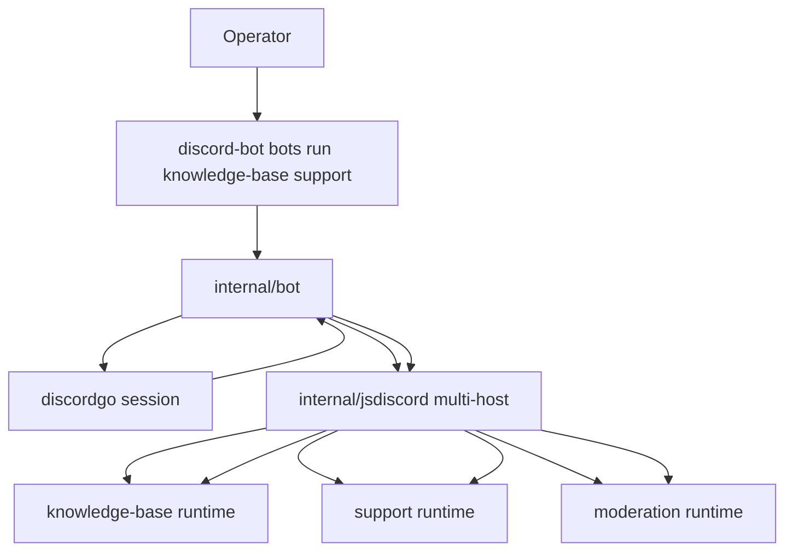

# Bot Repository Runner Architecture and Implementation Guide

## Executive Summary

The current `discord-bot bots ...` surface is still too close to generic jsverbs thinking. This ticket changes that. A **bot implementation** is now the top-level unit users discover, inspect, and run. `discord-bot bots run knowledge-base` should start the real Discord bot host for the `knowledge-base` implementation, not invoke one command inside that bot.

The implementation should reuse the existing local `require("discord")` bot API and treat repository discovery as a layer above it. The repository runner should discover bot scripts, load their metadata through `describe()`, expose them through `bots list|help|run`, and allow multiple selected bots to share one live Discord session as long as their slash-command names do not collide.

## Problem Statement

The current bot CLI package still assumes that “bot” means a callable CLI verb. That is the wrong abstraction. In this project, a bot implementation is the long-lived runtime unit. Each implementation can declare many slash commands and events, but the operator should run the implementation itself by name.

The old mental model leads to confusing UX such as “run one bot command locally.” The desired model is instead:

```text
discord-bot bots list
discord-bot bots help knowledge-base
discord-bot bots run knowledge-base
discord-bot bots run knowledge-base support moderation
```

## Proposed Solution

Implement a bot repository runner with four layers:

1. **Repository discovery**
   - scan one or more directories for discoverable bot scripts
   - load bot metadata by actually instantiating the local JS bot host
2. **Descriptor model**
   - normalize `name`, `description`, `commands`, `events`, and source path
3. **Multi-bot runtime composition**
   - run one or more selected bots inside one Discord host process
   - fan out non-command events to all bots
   - route slash commands to the owning bot
4. **Bot-oriented CLI**
   - `bots list`
   - `bots help <bot>`
   - `bots run <bot...>`

## Design Decisions

### 1. Discover bot implementations, not functions

Discovery should no longer care about arbitrary JS functions. It should care about scripts that export `defineBot(...)` via the local Discord JS API.

### 2. Use `describe()` as the discovery contract

The existing JS bot host already produces a structured description. Discovery should reuse that instead of adding a second metadata extraction mechanism.

### 3. Treat one bot implementation as one JS runtime by default

Each discovered bot should get its own JS runtime and in-memory store. This keeps bot-local state isolated and makes debugging easier.

### 4. Support multiple selected bots in one Discord session

Multiple bot implementations may run in one host process, but command-name collisions should be rejected clearly in v1.

### 5. Fan out event streams, route command ownership

- `ready`, `guildCreate`, `messageCreate` -> every selected bot
- slash command interaction -> owning bot only

## Discovery Rules

A repository should support two convenient shapes:

```text
bots/
  knowledge-base/index.js
  support/index.js
  moderation/index.js
  announcements.js
```

Rules:
- root-level `.js` files are discoverable bot scripts
- `index.js` files inside immediate or nested bot directories are discoverable bot scripts
- helper `.js` files under a bot directory are not top-level bot implementations unless they are named `index.js`
- `node_modules` and hidden directories are skipped

The discovered name should come from `configure({ name: ... })` first. If missing, fall back to a stable file/dir-derived name.

## Multi-Bot Runtime Model



Routing rules:
- command `/kb-search` -> only `knowledge-base`
- command `/support-ticket` -> only `support`
- `ready` -> all bots
- `messageCreate` -> all bots

## CLI Contract

### List

```bash
discord-bot bots list --bot-repository ./examples/discord-bots
```

Print bot names plus source information.

### Help

```bash
discord-bot bots help knowledge-base --bot-repository ./examples/discord-bots
```

Show:
- bot name
- description
- source path
- declared commands
- declared events

### Run

```bash
discord-bot bots run knowledge-base support \
  --bot-repository ./examples/discord-bots \
  --bot-token ... \
  --application-id ... \
  --guild-id ... \
  --sync-on-start
```

This should start the real long-lived Discord bot host with the selected implementations.

## Implementation Plan

### Phase 1 — descriptors and discovery
- introduce a bot descriptor model
- implement script candidate discovery
- inspect scripts via the local `require("discord")` host
- reject duplicate bot names

### Phase 2 — multi-bot composition
- add a multi-host layer
- aggregate slash commands
- reject duplicate command names
- route interactions and fan out events

### Phase 3 — CLI rewrite
- replace the current verb-oriented botcli code
- add list/help/run for named bots
- add config/env handling and `--sync-on-start`

### Phase 4 — example repositories and tests
- add several example bots
- add duplicate-name/duplicate-command fixtures
- validate discovery, help, run selection, and routing behavior

## Alternatives Considered

### Keep the current verb-oriented jsverbs-style runner

Rejected. It answers the wrong question: it invokes sub-functions inside a bot instead of running the bot implementation itself.

### Force one process per bot implementation only

Possible, but unnecessarily strict. One session plus multiple isolated JS runtimes is a more flexible model as long as command collisions are rejected.

## Review Notes

Review in this order:
- discovery/descriptors
- multi-host composition
- CLI rewrite
- example bots/tests
