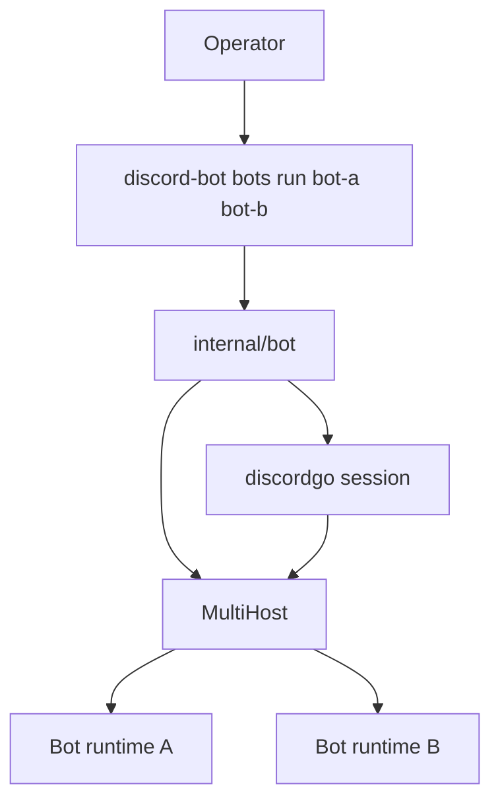
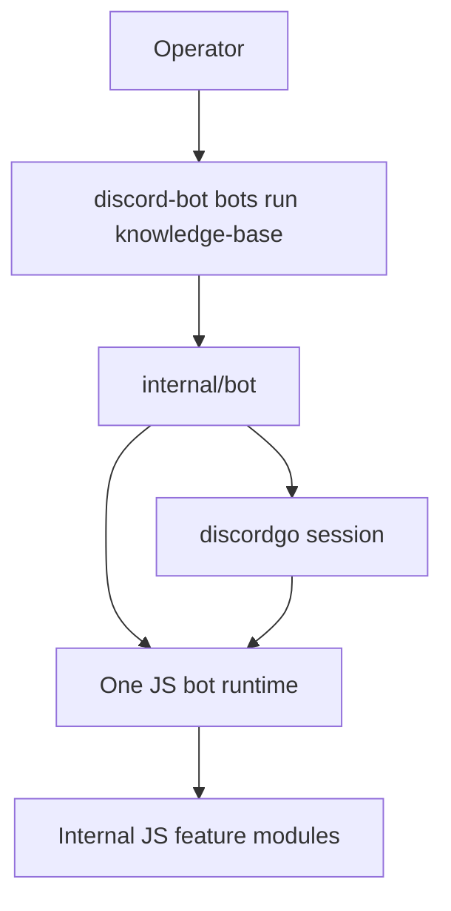

# Single JavaScript Bot Per Process Architecture and Implementation Guide

## Executive Summary

This ticket records a design pivot: the Discord host should run **one selected JavaScript bot implementation per process**, not multiple separately discovered bot implementations at once. If authors want to compose multiple logical capabilities, they should compose them *inside one selected bot* using normal JavaScript modules and internal routing.

This change simplifies three things immediately:

1. the runtime model
2. the operator-facing CLI
3. the future startup-flag model

The most important follow-on effect is that bot startup flags can now be treated as a dynamic **single-bot Glazed/Cobra schema** without needing any multi-bot flag namespacing story.

## Problem Statement

The recently added multi-bot runner solves a real possible use case, but it also introduces complexity that the project does not currently need:

- multiple descriptors must be resolved per run
- slash-command name collisions must be detected and rejected
- non-command events must be fanned out to all selected bots
- the CLI must reason about one-or-many selection
- future runtime flags become hard because multiple selected bots may define colliding flag names

That last point is the most important architectural constraint. If `knowledge-base` and `support` both define a runtime flag like `--index-path` or `--read-only`, the host either needs namespacing or needs to reject otherwise valid combinations. That is a lot of complexity for a problem that can be solved more cleanly by composing capabilities inside one selected JS bot.

## Proposed Solution

Return to this simpler model:

```text
discord-bot bots list
discord-bot bots help knowledge-base
discord-bot bots run knowledge-base
```

with these rules:

- `bots run` selects exactly one discovered bot implementation
- the host starts exactly one JS runtime for that bot
- all events and commands are handled inside that one bot runtime
- if a bot needs internal modularity, it should use JS modules / internal composition
- the host should not try to compose multiple top-level bot implementations in-process

## Why this is the better model now

### 1. Simpler operator mental model

An operator now answers one question only:

> Which bot implementation am I running?

There is no second question about how multiple selected implementations interact.

### 2. Simpler runtime ownership

One process, one Discord session, one JS runtime, one bot descriptor, one startup config block.

### 3. Simpler bot startup flags

This is the key reason for the pivot.

Once `bots run` only accepts one bot, the selected bot can expose startup fields through a jsverbs-compatible schema shape and the host can safely turn that into a dynamic Glazed/Cobra parser.

No multi-bot flag namespacing is needed.

### 4. JS composition is already the right place for capability aggregation

If a bot author wants a bot that includes:

- support flows
- moderation helpers
- knowledge lookup

that author can build one top-level `defineBot(...)` and compose helper modules underneath it:

```js
const support = require("./features/support")
const moderation = require("./features/moderation")
const knowledge = require("./features/knowledge")

module.exports = defineBot((api) => {
  support.register(api)
  moderation.register(api)
  knowledge.register(api)
})
```

That keeps composition in the JS domain, where it is easier to understand and test.

## Current vs target architecture

### Current multi-bot shape



### Target single-bot shape



## Design decisions

### 1. Keep discovery, drop multi-selection

The descriptor/discovery work remains useful. `bots list` and `bots help` should still inspect repositories and surface named bot implementations. Only the *run-time selection cardinality* changes.

### 2. Keep descriptor-based inspection

The selected bot should still be inspected via the existing `describe()` path. That gives the host and operator clear visibility into:

- name
- description
- commands
- events
- future run-schema metadata

### 3. Remove multi-host from the live path

The host should not rely on `MultiHost` to run the main bot process. One selected script should map to one `Host` / one runtime.

### 4. Make bot startup flags the next simplification target

After this rollback, the next natural step is to let a bot describe startup/runtime config using a jsverbs-compatible field/section model under `configure(...)`.

Because only one bot is selected, those fields can be exposed straight through the Glazed/Cobra stack without namespacing complexity.

## Recommended startup flag design after simplification

The selected bot should be able to say something like:

```js
configure({
  name: "knowledge-base",
  description: "Search internal docs",
  run: {
    sections: {
      storage: {
        title: "Storage",
        fields: {
          indexPath: {
            type: "string",
            help: "Path to the document index",
            required: true,
          },
          readOnly: {
            type: "bool",
            help: "Disable write operations",
          }
        }
      }
    }
  }
})
```

Then the host should:

1. resolve the single selected bot
2. inspect its descriptor
3. build a dynamic Glazed/Cobra schema from `run.sections/fields`
4. parse runtime flags using the normal Glazed medium
5. inject those values into the JS runtime as `ctx.config`

That is much cleaner in the single-bot model than in the multi-bot model.

## Implementation plan

### Phase 1 — CLI rollback

- change `bots run <bot...>` to `bots run <bot>`
- remove multi-bot selection helpers from the main run path
- keep `bots list` and `bots help <bot>`
- preserve `--print-parsed-values` for the single selected bot path

### Phase 2 — runtime rollback

- return `internal/bot/bot.go` to one selected bot script/runtime
- remove `MultiHost` from the live path
- keep descriptor inspection and discovery code
- delete the obsolete multi-host runtime layer once the single-bot model is confirmed

### Phase 3 — startup field architecture

- add `configure({ run: ... })`
- reuse jsverbs-style field and section definitions
- reuse Glazed/Cobra schema building for dynamic single-bot startup flags
- inject parsed values into the JS runtime as `ctx.config`

### Phase 4 — example cleanup

- add one canonical composed single-bot example
- make docs reflect single-bot runtime expectations
- remove operator-facing examples that imply multi-bot runs are the primary model

## Alternatives considered

### Keep multi-bot support and add namespaced startup flags

Possible, but heavy. It solves a complexity created by the host rather than simplifying the host.

### Run multiple processes with the same bot credentials

Technically possible, but also not the right model for this project. That still leaves shared command namespace, event duplication, and interaction-response races.

### Separate Discord applications for each logical bot

Valid for truly separate bots, but different from the goal here. This project is about one host selecting one JS bot implementation at a time.

## Detailed task notes

### Task group: runtime simplification

The runtime rollback should be small and targeted. Most of the useful work from discovery and descriptor inspection stays. The primary code removal is the assumption that the host must compose multiple selected scripts at once.

### Task group: CLI simplification

The CLI should become more legible:

```bash
discord-bot bots list --bot-repository ./examples/discord-bots
discord-bot bots help knowledge-base --bot-repository ./examples/discord-bots
discord-bot bots run knowledge-base --bot-repository ./examples/discord-bots
```

This is also where the dynamic Glazed startup flags can later slot in naturally.

### Task group: startup fields

This is the most important implementation guide section for future work. The desired architecture is to reuse:

- jsverbs-style field/section definitions
- Glazed schema building
- Glazed/Cobra parsed-values and config/env behavior

The host should *not* invent a second incompatible flag system for bot startup.

## Review instructions

Start review with:

- `internal/botcli/command.go`
- `internal/botcli/runtime.go`
- `internal/jsdiscord/host.go`
- `internal/bot/bot.go`

Then read this design doc with the current code in mind and confirm whether the extra host-level composition is still worth its complexity.
