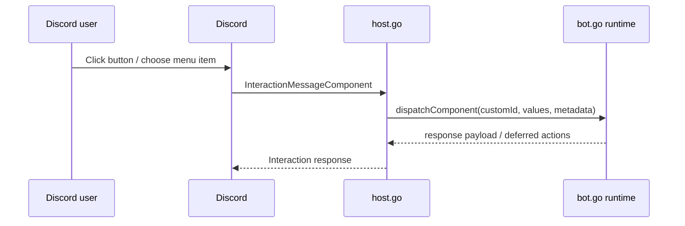

# Discord Component Interactions and Message Components Architecture and Implementation Guide

## Executive Summary

The current JS Discord API can send a narrow subset of Discord message components, but it cannot yet *receive* component interactions. That means bots can render a button, but they cannot handle the resulting click inside JavaScript. This ticket closes that loop.

The implementation should add a first-class `component(customId, handler)` registration API, route Discord `InteractionMessageComponent` events through the host layer, normalize select-menu values into the JS context, and expand outgoing component normalization so bots can emit the components they can actually handle.

## Problem Statement

A modern Discord bot needs more than slash commands. Buttons and select menus are central to richer UX, but the current host/runtime only supports application-command interactions. The evidence is straightforward:

- `internal/jsdiscord/host.go` only dispatches `InteractionApplicationCommand` today.
- `normalizeComponent(...)` currently understands buttons and action rows, but not select menus.
- `internal/jsdiscord/bot.go` exposes `command`, `event`, and `configure`, but no component registration surface.

As a result, JavaScript authors cannot build multi-step interaction flows without falling back to Go-side Discord handlers.

## Scope

This ticket covers:

- outbound message components for buttons and select menus
- inbound component interaction dispatch by `customId`
- JS context shape for component handlers
- descriptor/help visibility for registered component handlers

This ticket does **not** fully cover modal windows or autocomplete. Those are tracked separately so the implementation remains understandable and reviewable.

## Current-State Analysis

### What exists today

The current runtime already provides useful pieces that should be reused instead of rewritten:

- `internal/jsdiscord/bot.go` already has a clear builder pattern around `defineBot(...)`.
- `internal/jsdiscord/host.go` already has interaction responders with `reply`, `defer`, `edit`, and `followUp`.
- `normalizePayload(...)` already supports embeds, buttons, action rows, and allowed mentions.

That means the missing work is mostly about **dispatch and normalization breadth**, not a brand-new runtime model.

### What is missing today

The missing behaviors are:

1. No `component(...)` registration surface in JavaScript.
2. No descriptor output for component handlers.
3. No host routing for `discordgo.InteractionMessageComponent`.
4. No normalized select-menu payload support.
5. No JS context field for selected menu values or component metadata.

## Proposed JS API

### Builder registration

```js
const { defineBot } = require("discord")

module.exports = defineBot(({ command, component, configure }) => {
  configure({ name: "support-bot" })

  command("support", { description: "Open support flow" }, async (ctx) => {
    await ctx.reply({
      content: "Choose a queue",
      components: [
        {
          type: "actionRow",
          components: [
            {
              type: "select",
              customId: "support:queue",
              placeholder: "Pick a queue",
              options: [
                { label: "Billing", value: "billing" },
                { label: "Infra", value: "infra" },
              ]
            }
          ]
        }
      ]
    })
  })

  component("support:queue", async (ctx) => {
    return { content: `Selected ${ctx.values[0]}`, ephemeral: true }
  })
})
```

### Context contract

Component handlers should receive:

- `ctx.component.customId`
- `ctx.component.type`
- `ctx.values` for select values
- `ctx.message`, `ctx.user`, `ctx.guild`, `ctx.channel`
- `ctx.reply`, `ctx.defer`, `ctx.edit`, `ctx.followUp`

## Proposed internal shape

### Runtime registration model

Extend `botDraft` with a `components` collection. Each registration should capture:

- exact `customId`
- handler callable
- optional component metadata (future-friendly, but not required for v1)

### Descriptor model

`describe()` should include a `components` array so tooling can understand what the bot expects to receive.

Example descriptor fragment:

```json
{
  "components": [
    { "customId": "support:queue", "type": "component" },
    { "customId": "article:open", "type": "component" }
  ]
}
```

### Host routing model

When Discord sends `InteractionMessageComponent`:

1. determine the custom ID and component type
2. build a dispatch request with message/user/channel/guild data
3. include `values` for select menus
4. call the matching JS component handler
5. use the existing responder contract for replies/edits/follow-ups

## Sequence diagram



## Pseudocode

```text
on InteractionCreate:
  if interaction.Type == MessageComponent:
    data = interaction.MessageComponentData()
    request = {
      name: data.CustomID,
      component: { customId: data.CustomID, type: data.ComponentType },
      values: data.Values,
      ...common actor/message fields...
    }
    result = bot.dispatchComponent(request)
    emit response using existing responder helpers
```

## Implementation Plan

### Phase 1 — bot builder and descriptor support

Files:

- `internal/jsdiscord/bot.go`
- `internal/jsdiscord/descriptor.go`

Work:

- add `componentDraft`
- add `component(customId, handler)` builder method
- include `components` in `describe()` output
- parse components into `BotDescriptor`

### Phase 2 — host dispatch

Files:

- `internal/jsdiscord/host.go`
- `internal/jsdiscord/bot.go`

Work:

- add `DispatchComponent(...)` or equivalent dispatch branch
- build `ctx.component` and `ctx.values`
- keep reply/defer/edit/followUp parity with command handlers

### Phase 3 — richer outgoing component normalization

Files:

- `internal/jsdiscord/host.go`
- `internal/jsdiscord/runtime_test.go`

Work:

- support string select menus first
- support user/role/channel/mentionable select menu variants where easy
- support menu placeholder, disabled, min/max values, and options

### Phase 4 — routing and examples

Files:

- `internal/jsdiscord/host.go`
- `examples/discord-bots/ping/index.js`
- `examples/discord-bots/README.md`

Work:

- preserve component routing in the live single-bot host path
- update example bot to demonstrate button/select flows

## Test Strategy

1. Runtime test: register `component("x", ...)` and verify dispatch result.
2. Runtime test: select-menu interaction should populate `ctx.values`.
3. Payload test: outgoing select-menu payload should normalize into discordgo component structs.
4. Descriptor test: discovered bot should report component custom IDs.
5. Host routing test: component interactions must still reach the owning bot through the live single-bot host path.

## Risks and Tradeoffs

### Risk: unstable custom ID design

If examples encourage ad-hoc custom IDs, authors may create collisions or brittle parsing. Documentation should encourage namespaced IDs like `feature:action[:arg]`.

### Risk: over-generalized component abstraction

A small exact-match custom-ID model is the right v1. Pattern matching can come later if needed.

## Alternatives Considered

### Route component interactions through generic events

Rejected. A dedicated `component(...)` registration surface is clearer and easier to describe in help output.

### Support every Discord component type immediately

Rejected for v1. Buttons and select menus cover the most useful slice while keeping implementation and testing tractable.

## References

- `internal/jsdiscord/host.go`
- `internal/jsdiscord/bot.go`
- `internal/jsdiscord/descriptor.go`
- `internal/jsdiscord/runtime_test.go`
- `examples/discord-bots/ping/index.js`
