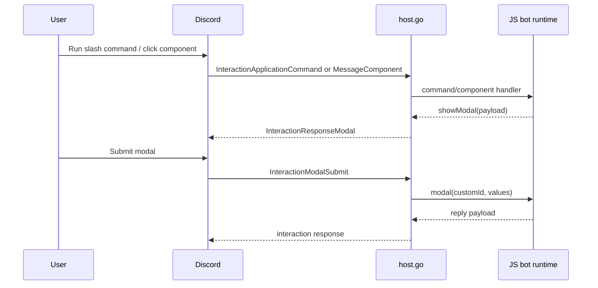

# Discord Modals and Text Input Workflows Architecture and Implementation Guide

## Executive Summary

Discord modals are the natural next step after commands and buttons. They let a bot gather structured text input without forcing the user through many slash-command options. This ticket adds the missing modal lifecycle to the JS API:

1. a command or component handler opens a modal with `ctx.showModal(...)`
2. Discord shows the modal to the user
3. the user submits text input
4. the JS runtime receives a modal submit handler call with normalized values

## Problem Statement

The current runtime can send ordinary interaction responses and follow-ups, but it cannot respond with `InteractionResponseModal`, cannot define text-input modal payloads, and cannot route `InteractionModalSubmit` back into JavaScript. That leaves a major Discord UX gap.

## Scope

This ticket covers:

- modal response payloads
- text-input component normalization for modal bodies
- `ctx.showModal(...)` on command/component contexts
- `modal(customId, handler)` registrations
- modal submit context values

This ticket intentionally keeps the payload model simple and defers advanced validation/abstractions until the basic lifecycle works.

## Proposed JS API

### Open a modal

```js
command("feedback", { description: "Open feedback modal" }, async (ctx) => {
  await ctx.showModal({
    customId: "feedback:submit",
    title: "Feedback",
    components: [
      {
        type: "actionRow",
        components: [
          {
            type: "textInput",
            customId: "summary",
            label: "Summary",
            style: "short",
            required: true,
            minLength: 5,
            maxLength: 100,
          }
        ]
      }
    ]
  })
})
```

### Handle a modal submit

```js
modal("feedback:submit", async (ctx) => {
  return {
    content: `Thanks: ${ctx.values.summary}`,
    ephemeral: true,
  }
})
```

## Current-State Analysis

The current runtime already has most of the general-purpose interaction machinery:

- interaction responders know how to reply, defer, edit, and follow up
- request/context builders already pass maps and callback functions into JavaScript
- payload normalization already translates JS objects into Discord message responses

What is missing is specifically modal-specific behavior:

- `InteractionResponseModal`
- text-input normalization
- modal-submit interaction parsing
- modal handler registration

## Proposed Internal Model

### Registration model

Extend `botDraft` with `modals`, keyed by modal custom ID. The handler contract should look just like commands/components: exact-match ID dispatch for v1.

### Context model

Modal submit handlers should receive:

- `ctx.modal.customId`
- `ctx.values` as a map from text-input custom IDs to submitted strings
- `ctx.interaction`, `ctx.user`, `ctx.guild`, `ctx.channel`
- `ctx.reply`, `ctx.defer`, `ctx.edit`, `ctx.followUp`

### Response model

`ctx.showModal(payload)` should only be available on interaction-backed contexts where Discord allows modal responses. If a handler tries to show a modal in `messageCreate`, the host should return a clear error.

## Diagram



## Pseudocode

```text
ctx.showModal(payload):
  normalize modal title/customId/components
  session.InteractionRespond(type=Modal, data=normalized)

on InteractionModalSubmit:
  data = interaction.ModalSubmitData()
  values = extractTextInputs(data.Components)
  request = {
    name: data.CustomID,
    modal: { customId: data.CustomID },
    values: values,
    ...common fields...
  }
  dispatch modal handler
```

## Implementation Plan

### Phase 1 — payload normalization

Files:

- `internal/jsdiscord/host.go`

Work:

- add modal payload normalization helper
- add text-input normalization helper
- map simple JS styles (`short`, `paragraph`) to discordgo constants

### Phase 2 — runtime contract

Files:

- `internal/jsdiscord/bot.go`

Work:

- add `modal(customId, handler)` registration
- add `showModal` function to the dispatch input/context
- add modal descriptors to `describe()`

### Phase 3 — submit dispatch

Files:

- `internal/jsdiscord/host.go`
- `internal/jsdiscord/runtime_test.go`

Work:

- parse `ModalSubmitData().Components`
- extract text-input values by `customId`
- dispatch to the registered modal handler

### Phase 4 — examples and documentation

Files:

- `examples/discord-bots/ping/index.js`
- `examples/discord-bots/README.md`

Work:

- add a command or component flow that opens a modal and handles the submit
- document supported text-input fields and limitations

## Test Strategy

1. Normalize modal payload into `discordgo.InteractionResponse{Type: Modal}`.
2. Normalize text inputs with labels, lengths, placeholders, and style.
3. Dispatch a modal submit and verify `ctx.values` contents.
4. Ensure unsupported contexts return a clear `showModal` error.

## Risks and Tradeoffs

### Risk: over-complicated modal schema

Discord modals are strict. The v1 API should stay close to Discord’s shape instead of inventing an abstraction that later becomes harder to map.

### Risk: confusing overlap with components

Modals and components are separate tickets, but the runtime contract should be compatible: component handlers should be able to open modals, and modal handlers should reuse the same response helpers.

## References

- `internal/jsdiscord/host.go`
- `internal/jsdiscord/bot.go`
- `internal/jsdiscord/runtime_test.go`
- `examples/discord-bots/ping/index.js`
