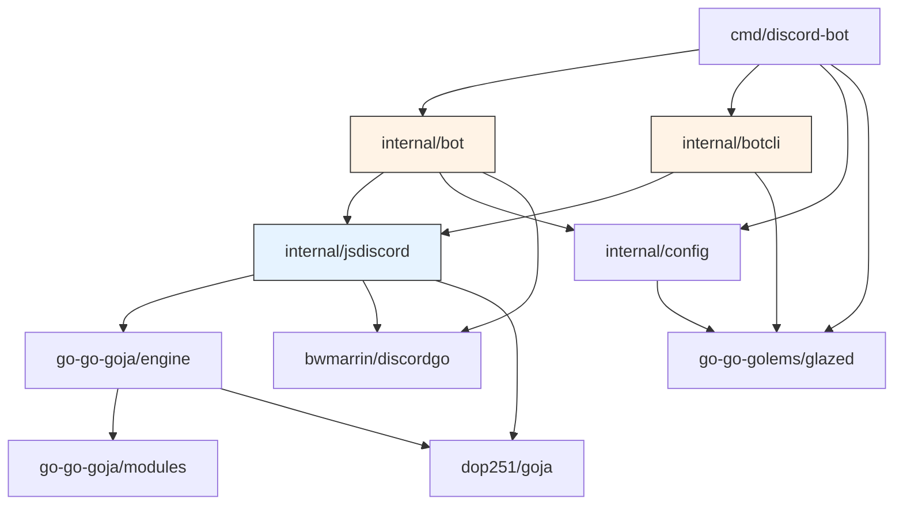

# Framework Extraction Design and Implementation Guide

## Executive Summary

The JS Discord Bot project is currently a standalone Go CLI application: `discord-bot bots run <bot>` starts a process, connects to Discord, loads one JavaScript bot script, and handles events until the process exits. This works well for running a dedicated bot, but it prevents the Discord bot runtime from being embedded in other Go software.

This document proposes extracting the core runtime into a **reusable Go framework** so that any Go application can add a Discord bot surface as a feature. The motivating example is a web server with a database: instead of running a separate `discord-bot` process alongside it, the web server would import the framework, load a JS bot script, and expose Discord bot commands that can call into the same database and business logic the web server already manages.

The framework should be **opinionated but flexible**:

- **Opinionated** because it should ship with working defaults for the common case (standalone bot, Glazed CLI, `discordgo` session). An embedder should not have to re-implement session management, intent registration, or payload normalization.
- **Flexible** because embedders must be able to provide their own primitives — a database connection pool, an HTTP client, a custom Go module that exposes additional JS functions via `require()`, or even a completely different Discord transport (HTTP interactions instead of gateway).

We present three design options, analyze their trade-offs, and recommend a hybrid approach that gives embedders the best of all worlds.

**2026-04-22 update:** the jsverbs unification work changed one important conclusion from the earlier draft. It is no longer enough to say “the framework should expose the runtime, and downstream apps can copy the CLI glue if they want.” The current `discord-bot` now has working repository discovery, explicit jsverbs scanning, host-managed `run` verbs, compatibility `bots run <bot>` aliases, root-level `--bot-repository` bootstrap, and Glazed env-middleware integration for dynamic bot commands. That behavior is valuable enough that embedders should get it as an **optional public package**, not just as a reference implementation hidden inside `internal/botcli`.

## Problem Statement

### What we have today

The `discord-bot` binary is a monolithic CLI application. Its entrypoint (`cmd/discord-bot/main.go`) builds a Cobra command tree, wires Glazed help/logging/config layers, and exposes two command paths:

1. **Glazed commands** (`run`, `sync-commands`, `validate-config`) — These use the `internal/bot` package directly with a `config.Settings` struct for credentials.
2. **Bot CLI commands** (`bots list`, `bots help`, `bots run`) — These use `internal/botcli` for discovery and dynamic schema parsing, then fall through to `internal/bot` for execution.

Both paths end up in the same place: `internal/bot.NewWithScript()` creates a `discordgo.Session`, loads a JavaScript bot script through `jsdiscord.NewHost()`, registers event handlers on the session, and starts the gateway connection.

### What we cannot do today

The tight coupling between these packages prevents several real-world use cases:

- **A web server that also has a Discord bot.** The server has a database, authentication middleware, and business logic. It wants to expose Discord bot commands that can query and mutate the same data. Today, this requires running a separate `discord-bot` process and communicating via IPC or a shared database — adding latency, complexity, and failure modes.

- **Adding custom Go primitives to the JS runtime.** An embedder might want to expose `require("database")` or `require("http-client")` to their bot scripts. Today, adding a new goja native module requires modifying the `go-go-goja` dependency repo and then importing it in `internal/jsdiscord`. There is no way for an embedder to register their own modules without forking the project.

- **Testing bot scripts without a real Discord connection.** The `jsdiscord.Host` creates a real goja runtime and loads real scripts, but the Discord ops (`DiscordOps`) are always built from a live `discordgo.Session`. There is no built-in way to inject mock ops for integration testing.

- **HTTP interactions instead of gateway.** Discord supports receiving interactions via HTTP webhooks instead of the websocket gateway. Today, the framework assumes gateway-only. An HTTP interaction server would need to call `DispatchInteraction()` with different responder callbacks, but the session coupling makes this awkward.

### What "reusable framework" means here

We want to reach a state where an embedder can write:

```go
package main

import (
    "net/http"
    "github.com/go-go-golems/discord-bot-framework"
    "github.com/go-go-golems/discord-bot-framework/providers/gateway"
    _ "my-app/discord-modules/database"  // custom require("database") module
)

func main() {
    // Your existing web server
    mux := http.NewServeMux()
    db := setupDatabase()

    // Add a Discord bot surface
    bot, err := framework.New(
        framework.WithScript("./bots/knowledge-base/index.js"),
        framework.WithCredentialsFromEnv(),
        gateway.WithIntents(discordgo.IntentsGuilds | discordgo.IntentsGuildMessages),
        framework.WithModule("database", databaseModuleLoader(db)),
        framework.WithRuntimeConfig(map[string]any{"dbPath": "/data/app.db"}),
    )
    if err != nil {
        log.Fatal(err)
    }
    defer bot.Close()

    // Sync commands and start gateway
    if err := bot.SyncCommands(); err != nil {
        log.Fatal(err)
    }
    go bot.Run(context.Background())

    // Your web server continues as normal
    log.Fatal(http.ListenAndServe(":8080", mux))
}
```

This is the target developer experience. The rest of this document explains how to get there.

## Current Architecture

Before proposing changes, we need to understand what exists today. This section walks through every package, its role, its dependencies, and its coupling points.

### Package map

```
2026-04-20--js-discord-bot/
├── cmd/discord-bot/          # CLI entrypoint (application, not framework)
│   ├── main.go               # func main()
│   ├── root.go               # Cobra root + Glazed wiring + botcli.NewCommand()
│   └── commands.go           # Glazed commands: run, sync-commands, validate-config
├── internal/
│   ├── bot/                  # Live Discord host wiring
│   │   └── bot.go            # Bot struct, New(), NewWithScript(), event handlers
│   ├── botcli/               # Bot discovery, CLI, dynamic schema
│   │   ├── bootstrap.go      # Repository discovery from filesystem
│   │   ├── command.go        # bots list/help/run Cobra commands
│   │   ├── model.go          # Bootstrap, Repository, DiscoveredBot types
│   │   ├── resolve.go        # Bot name resolution
│   │   ├── run_dynamic_schema.go  # Glazed schema from bot run metadata
│   │   ├── run_help.go       # Bot help renderer
│   │   ├── run_static_args.go    # Static pre-parser for bots run
│   │   └── runtime.go        # RunRequest, runSelectedBots, settingsFromValues
│   ├── config/
│   │   └── config.go         # Settings struct (Glazed-backed credentials)
│   └── jsdiscord/            # ★ Core runtime — main extraction target ★
│       ├── bot_compile.go    # BotHandle, DiscordOps, DispatchRequest, draft types
│       ├── bot_context.go    # buildContext() — JS ctx object assembly
│       ├── bot_dispatch.go   # Event dispatch closures
│       ├── bot_logging.go    # Per-dispatch logging helpers
│       ├── bot_ops.go        # Generic op wrappers (op1, op2, op1A, etc.)
│       ├── bot_store.go      # Per-bot MemoryStore
│       ├── descriptor.go     # BotDescriptor, parsing, inspection
│       ├── host.go           # Host struct, NewHost(), Describe(), ApplicationCommands()
│       ├── host_commands.go  # Discord ApplicationCommand building
│       ├── host_dispatch.go  # All Dispatch* methods + responder wiring
│       ├── host_logging.go   # Lifecycle debug logging
│       ├── host_maps.go      # Snapshot/map conversion helpers
│       ├── host_ops.go       # buildDiscordOps() entrypoint
│       ├── host_ops_channels.go
│       ├── host_ops_guilds.go
│       ├── host_ops_helpers.go
│       ├── host_ops_members.go
│       ├── host_ops_messages.go
│       ├── host_ops_roles.go
│       ├── host_ops_threads.go
│       ├── host_responses.go # interactionResponder, channelResponder
│       ├── payload_*.go      # Payload normalization (embeds, components, files, etc.)
│       ├── runtime.go        # Registrar, RuntimeState, Loader, defineBot
│       ├── snapshot_builders.go
│       ├── snapshot_types.go
│       └── store.go          # MemoryStore implementation
└── examples/discord-bots/    # Example JS bot scripts
```

### Dependency graph



**Key observation:** The `jsdiscord` package (blue) has clean dependencies — it only reaches into `engine`, `discordgo`, and `goja`. The `bot` and `botcli` packages (orange) are application-level wiring that sit on top.

### The five coupling points

After reading every file, here are the exact places where the current monolithic structure resists embedding:

#### 1. `jsdiscord.NewHost()` owns the engine factory

**File:** `internal/jsdiscord/host.go:25–40`

```go
func NewHost(ctx context.Context, scriptPath string) (*Host, error) {
    // ...
    factory, err := engine.NewBuilder(
        engine.WithModuleRootsFromScript(absScript, engine.DefaultModuleRootsOptions()),
    ).WithModules(engine.DefaultRegistryModules()).
        WithRuntimeModuleRegistrars(NewRegistrar(Config{})).
        WithRequireOptions(require.WithGlobalFolders(...)).
        Build()
    // ...
}
```

**Problem:** The host hardcodes its engine builder configuration. An embedder cannot add their own goja modules, change the module root resolution, or pass custom require options. The `WithModules(engine.DefaultRegistryModules())` call only picks up modules from the `go-go-goja/modules` registry — not from the embedding application.

**What needs to change:** The engine factory configuration must be injectable. The framework should accept a list of `engine.ModuleSpec` values and `engine.RuntimeInitializer` values so embedders can register their own modules.

#### 2. `bot.NewWithScript()` owns the Discord session

**File:** `internal/bot/bot.go:23–42`

```go
func NewWithScript(cfg appconfig.Settings, script string, runtimeConfig map[string]any) (*Bot, error) {
    session, err := discordgo.New("Bot " + strings.TrimSpace(cfg.BotToken))
    // ...
    session.Identify.Intents = discordgo.IntentsGuilds | discordgo.IntentsGuildMessages | ...
    // ...
    session.AddHandler(b.handleReady)
    session.AddHandler(b.handleGuildCreate)
    // ... 10+ more handlers
}
```

**Problem:** The session creation, intent selection, and handler registration are all inline in one constructor. An embedder cannot:
- Use a pre-existing session
- Change the intent set
- Use HTTP interactions instead of gateway
- Add their own middleware around event handling

**What needs to change:** Session lifecycle must be separable from bot logic. The framework should provide a default gateway provider but accept alternative providers (HTTP, mock, custom).

#### 3. `DiscordOps` is populated from `*discordgo.Session` only

**File:** `internal/jsdiscord/host_dispatch.go:12–18`

```go
func (h *Host) baseDispatchRequest(session *discordgo.Session) DispatchRequest {
    return DispatchRequest{
        Discord: buildDiscordOps(h.scriptPath, session),
        // ...
    }
}
```

Each `build*Ops()` helper (`buildChannelOps`, `buildMessageOps`, etc.) closes over the session and populates function pointers on `DiscordOps`. These ops are what JS handlers call when they do `ctx.discord.channels.send(...)`.

**Problem:** The ops are always wired to a live `discordgo.Session`. An embedder cannot:
- Inject custom ops that call their own backend
- Mock ops for testing
- Add additional ops (e.g., `ctx.discord.database.query()`)

**What needs to change:** `DiscordOps` must be injectable. The framework should let embedders provide a custom `DiscordOps` (or extend the default one) when constructing the host.

#### 4. Responder callbacks are built from `discordgo` types

**File:** `internal/jsdiscord/host_responses.go`

The `interactionResponder` and `channelResponder` types wrap `discordgo.Session.InteractionRespond()`, `Session.FollowupMessageCreate()`, etc. These are the functions behind `ctx.reply()`, `ctx.defer()`, `ctx.followUp()`, `ctx.edit()`, and `ctx.showModal()`.

**Problem:** These responders are always built from a live Discord interaction. An embedder using HTTP interactions would need different responder wiring. A test would need mock responders.

**What needs to change:** The responder construction must be abstracted behind a builder that accepts a generic interaction/event context rather than a concrete `discordgo` type.

#### 5. Config is a concrete struct, not an interface

**File:** `internal/config/config.go`

```go
type Settings struct {
    BotToken      string `glazed:"bot-token"`
    ApplicationID string `glazed:"application-id"`
    GuildID       string `glazed:"guild-id"`
    // ...
}
```

**Problem:** This is a flat Glazed-backed struct with no extension points. An embedder cannot add their own config fields without modifying the struct or inventing a parallel config system.

**What needs to change:** The framework should define a minimal credentials interface and let embedders compose it with their own config.


## Design Options

We present three design options. Each addresses the five coupling points differently. After presenting all three, we compare them and recommend a hybrid approach.

---

## Option A: Interface-Based Extraction

### Core idea

Define Go interfaces for every extension point. The framework code depends only on interfaces; concrete implementations (gateway, HTTP, mock) are provided as separate packages. Embedders implement the interfaces to provide custom behavior.

### New package structure

```
discord-bot-framework/           # The extracted framework (importable Go module)
├── framework.go                 # Framework struct, New(), functional options
├── host.go                      # Host struct (extracted from jsdiscord)
├── bot_handle.go                # BotHandle, DispatchRequest (extracted)
├── descriptor.go                # BotDescriptor, parsing (extracted)
├── runtime.go                   # Registrar, defineBot loader (extracted)
├── bot_context.go               # JS context assembly (extracted)
├── payloads.go                  # Payload normalization (extracted)
├── snapshots.go                 # Snapshot types and builders (extracted)
├── store.go                     # MemoryStore (extracted)
├── interfaces.go                # ★ All framework interfaces ★
├── options.go                   # Functional option types
├── providers/
│   ├── gateway/
│   │   ├── provider.go          # GatewayProvider implementing TransportProvider
│   │   ├── session_ops.go       # buildDiscordOps from *discordgo.Session
│   │   └── responders.go        # interactionResponder, channelResponder
│   ├── http/
│   │   └── provider.go          # HTTP interaction provider
│   └── mock/
│       └── provider.go          # Test mock provider
└── doc/                         # Embedded help pages
```

The existing `cmd/discord-bot/` binary becomes a thin wrapper that imports the framework and the gateway provider.

### Interface definitions

The central file `interfaces.go` defines the extension points:

```go
// framework/interfaces.go

package framework

import "context"

// Credentials holds the minimal Discord authentication data.
// Embedders can satisfy this with their own config system.
type Credentials interface {
    BotToken() string
    ApplicationID() string
    GuildID() string  // empty means global
}

// TransportProvider manages the Discord connection lifecycle.
// The gateway provider uses discordgo.Session; the HTTP provider uses
// a webhook handler; the mock provider does nothing.
type TransportProvider interface {
    // Connect establishes the connection to Discord.
    Connect(ctx context.Context) error

    // Close shuts down the connection.
    Close(ctx context.Context) error

    // SyncCommands registers slash commands with Discord.
    SyncCommands(ctx context.Context, commands []*ApplicationCommandInfo) error

    // Intents returns the Discord gateway intents this provider requires.
    // Returns 0 for non-gateway providers.
    Intents() discordgo.GatewayIntent
}

// ResponderFactory creates reply/followUp/edit/defer/showModal callbacks
// for a specific interaction or event context.
type ResponderFactory interface {
    // InteractionResponders builds the five responder callbacks for an
    // incoming interaction (application command, component, modal, autocomplete).
    InteractionResponders(ctx context.Context, interaction *InteractionInfo) (
        Reply func(ctx context.Context, payload any) error,
        FollowUp func(ctx context.Context, payload any) error,
        Edit func(ctx context.Context, payload any) error,
        Defer func(ctx context.Context, payload any) error,
        ShowModal func(ctx context.Context, payload any) error,
    )

    // ChannelResponders builds the reply/edit callbacks for a channel-based
    // event (messageCreate, reactionAdd, etc.).
    ChannelResponders(ctx context.Context, channelID string) (
        Reply func(ctx context.Context, payload any) error,
        Edit func(ctx context.Context, payload any) error,
    )
}

// OpsProvider populates the DiscordOps struct for a given request context.
// The default gateway provider fills ops from a discordgo.Session.
// Embedders can extend this to add custom ops (e.g., database ops).
type OpsProvider interface {
    BuildOps(ctx context.Context) *DiscordOps
}

// ModuleProvider registers additional goja native modules.
// Embedders implement this to expose require("database"), require("http"), etc.
type ModuleProvider interface {
    ModuleName() string
    ModuleLoader(vm *goja.Runtime, moduleObj *goja.Object)
}
```

### How the five coupling points are addressed

| Coupling point | Option A solution |
|---|---|
| Engine factory ownership | `WithModuleProviders(...)` functional option adds embedder modules to the engine builder |
| Session ownership | `TransportProvider` interface — embedder chooses gateway, HTTP, or custom |
| DiscordOps population | `OpsProvider` interface — embedder provides ops or extends default |
| Responder callbacks | `ResponderFactory` interface — embedder provides responders for their transport |
| Config struct | `Credentials` interface — embedder satisfies with any config system |

### Embedder API

```go
// An embedder adding a Discord bot to their web server:

import (
    "github.com/go-go-golems/discord-bot-framework"
    "github.com/go-go-golems/discord-bot-framework/providers/gateway"
)

func setupDiscordBot(db *sql.DB) (*framework.Framework, error) {
    return framework.New(
        framework.WithScript("./bots/knowledge-base/index.js"),
        framework.WithCredentials(myCredentials{}),    // implements Credentials
        framework.WithTransportProvider(
            gateway.NewProvider(gateway.WithIntents(
                discordgo.IntentsGuilds | discordgo.IntentsGuildMessages,
            )),
        ),
        framework.WithModuleProviders(
            database.NewModuleProvider(db),  // custom require("database")
        ),
        framework.WithRuntimeConfig(map[string]any{
            "dbPath": "/data/app.db",
        }),
    )
}
```

### Pros

- **Maximum flexibility.** Every seam is an interface. Embedders can replace any piece.
- **Testable by design.** Mock implementations of every interface make testing straightforward.
- **Clean separation.** The framework package has zero imports on `discordgo` in its core path. Only the `providers/gateway` sub-package imports it.

### Cons

- **Interface explosion.** Five interfaces (Credentials, TransportProvider, ResponderFactory, OpsProvider, ModuleProvider) with multiple methods each. This is a lot of surface area to maintain and document.
- **Boilerplate for simple cases.** An embedder who just wants "run a bot script with the defaults" still needs to understand the provider model. The `providers/gateway` package reduces this, but the mental model is still "pick your providers."
- **ResponderFactory is awkward.** Returning five separate function closures from one method is not idiomatic Go. The responder lifecycle (reply-then-follow-up, defer-then-edit, etc.) is inherently stateful and hard to capture cleanly in a factory interface.
- **Interface drift.** As Discord adds new interaction types or event surfaces, the interfaces need to grow. Every change is a breaking change for implementors.

### When this option is best

When the framework is a public library used by many different teams who need to deeply customize the transport, ops, and module layers. The interface overhead is justified by the breadth of consumers.


---

## Option B: Functional Options Builder (Opinionated Core)

### Core idea

Instead of defining interfaces for every seam, expose a single `Framework` struct configured through functional options. The framework has a strong opinion about how things work (gateway + `discordgo` + goja), but provides well-placed hooks where embedders can inject custom behavior without implementing full interfaces.

The key insight is that most embedders don't want to replace the entire transport layer or responder system. They want to:

1. Load a bot script
2. Add their own Go modules to the JS runtime
3. Optionally add custom ops to the JS context
4. Optionally customize the gateway intents

For these use cases, a functional options builder is simpler and more idiomatic than a full interface hierarchy.

### New package structure

```
discord-bot-framework/
├── framework.go          # Framework struct + New() + functional options
├── host.go               # Host struct (from jsdiscord, slightly modified)
├── host_dispatch.go      # Dispatch methods (from jsdiscord, parameterized)
├── host_responses.go     # Responders (from jsdiscord, unchanged)
├── bot_handle.go         # BotHandle, DispatchRequest, DiscordOps
├── bot_compile.go        # defineBot, draft types, finalize
├── bot_context.go        # buildContext
├── bot_ops.go            # Generic op wrappers
├── descriptor.go         # BotDescriptor, parsing, inspection
├── runtime.go            # Registrar, RuntimeState
├── payloads.go           # Payload normalization (all payload_*.go merged)
├── snapshots.go          # Snapshot types and builders
├── store.go              # MemoryStore
├── host_ops.go           # buildDiscordOps — now accepts custom ops
├── host_ops_channels.go
├── host_ops_messages.go
├── host_ops_members.go
├── host_ops_roles.go
├── host_ops_threads.go
├── host_ops_guilds.go
├── host_logging.go
├── host_commands.go
├── host_maps.go
├── options.go            # ★ Functional options ★
├── credentials.go        # Simple Credentials struct (not an interface)
└── doc/                  # Embedded help pages
```

Notice there is no `providers/` directory and no `interfaces.go`. The framework is the gateway provider. If you want HTTP interactions, you don't implement a `TransportProvider` — you call `DispatchInteraction()` directly with your own responder callbacks.

### Functional options

```go
// framework/options.go

package framework

import (
    "context"
    "github.com/dop251/goja"
    "github.com/bwmarrin/discordgo"
    "github.com/go-go-golems/go-go-goja/engine"
)

// Option configures a Framework instance.
type Option func(*config) error

type config struct {
    scriptPath    string
    credentials   Credentials
    runtimeConfig map[string]any
    intents       discordgo.GatewayIntent
    guildID       string
    syncOnStart   bool

    // Engine extensions
    extraModules     []engine.ModuleSpec
    extraInitializers []engine.RuntimeInitializer
    requireOptions   []require.Option

    // Ops extensions — the embedder can add ops that JS handlers can call
    customOps func(ctx context.Context) *DiscordOps  // merge with default gateway ops

    // Module root resolution
    moduleRootOpts engine.ModuleRootsOptions
}

// WithScript sets the JavaScript bot script path.
func WithScript(path string) Option {
    return func(c *config) error {
        c.scriptPath = path
        return nil
    }
}

// WithCredentials sets the Discord bot credentials.
func WithCredentials(creds Credentials) Option {
    return func(c *config) error {
        c.credentials = creds
        return nil
    }
}

// WithCredentialsFromEnv reads credentials from DISCORD_BOT_TOKEN,
// DISCORD_APPLICATION_ID, and DISCORD_GUILD_ID environment variables.
func WithCredentialsFromEnv() Option { /* ... */ }

// WithIntents overrides the default gateway intents.
func WithIntents(intents discordgo.GatewayIntent) Option {
    return func(c *config) error {
        c.intents = intents
        return nil
    }
}

// WithRuntimeConfig injects startup config values accessible as ctx.config in JS.
func WithRuntimeConfig(config map[string]any) Option {
    return func(c *config) error {
        c.runtimeConfig = config
        return nil
    }
}

// WithModule registers a custom goja native module.
// This is the primary extension point for embedders.
//
// Example:
//   framework.WithModule("database", func(vm *goja.Runtime, moduleObj *goja.Object) {
//       exports := moduleObj.Get("exports").(*goja.Object)
//       exports.Set("query", func(sql string) any { ... })
//   })
func WithModule(name string, loader func(*goja.Runtime, *goja.Object)) Option {
    return func(c *config) error {
        c.extraModules = append(c.extraModules, engine.NativeModuleSpec{
            ModuleName: name,
            Loader:     loader,
        })
        return nil
    }
}

// WithExtraOps registers a function that returns additional DiscordOps
// to be merged into the default ops on every dispatch.
//
// Example — adding a database namespace to ctx.discord:
//   framework.WithExtraOps(func(ctx context.Context) *DiscordOps {
//       return &DiscordOps{
//           // could add a CustomDB field if DiscordOps grows one
//       }
//   })
func WithExtraOps(fn func(ctx context.Context) *DiscordOps) Option {
    return func(c *config) error {
        c.customOps = fn
        return nil
    }
}

// WithGuildID scopes slash command registration to a specific guild.
func WithGuildID(guildID string) Option { /* ... */ }

// WithModuleRootsOptions customizes the module resolution paths.
func WithModuleRootsOptions(opts engine.ModuleRootsOptions) Option { /* ... */ }
```

### The Framework struct

```go
// framework/framework.go

package framework

import (
    "context"
    "github.com/bwmarrin/discordgo"
)

type Framework struct {
    cfg     config
    session *discordgo.Session
    host    *Host
}

func New(opts ...Option) (*Framework, error) {
    cfg := defaultConfig()
    for _, opt := range opts {
        if err := opt(&cfg); err != nil {
            return nil, err
        }
    }
    if err := cfg.validate(); err != nil {
        return nil, err
    }

    // Create Discord session
    session, err := discordgo.New("Bot " + cfg.credentials.BotToken())
    if err != nil {
        return nil, err
    }
    session.Identify.Intents = cfg.intents

    // Create JS host with embedder's modules
    host, err := newHostWithConfig(context.Background(), cfg)
    if err != nil {
        return nil, err
    }

    fw := &Framework{cfg: cfg, session: session, host: host}

    // Register event handlers (same as current bot.go)
    session.AddHandler(fw.handleReady)
    session.AddHandler(fw.handleInteractionCreate)
    session.AddHandler(fw.handleMessageCreate)
    // ... etc

    return fw, nil
}

func (fw *Framework) Run(ctx context.Context) error {
    if err := fw.session.Open(); err != nil {
        return err
    }
    <-ctx.Done()
    return fw.Close(ctx)
}

func (fw *Framework) Close(ctx context.Context) error {
    _ = fw.session.Close()
    return fw.host.Close(ctx)
}

func (fw *Framework) SyncCommands() ([]*discordgo.ApplicationCommand, error) {
    // Same as current bot.SyncCommands
}

// Descriptor returns the loaded bot's descriptor for inspection.
func (fw *Framework) Descriptor() *BotDescriptor {
    // ...
}
```

### How the five coupling points are addressed

| Coupling point | Option B solution |
|---|---|
| Engine factory ownership | `WithModule()` adds embedder's modules to the engine builder inside `newHostWithConfig()` |
| Session ownership | Framework owns the session. Embedder configures intents via `WithIntents()`. No interface — just functional options. |
| DiscordOps population | `WithExtraOps()` merges embedder ops into the default gateway ops. The default ops are always present. |
| Responder callbacks | Unchanged from current code. Responders are always built from `discordgo` types inside the framework. Embedders who need custom responders call `DispatchInteraction()` directly. |
| Config struct | Simple `Credentials` struct with helper `WithCredentialsFromEnv()`. No interface needed. |

### Embedder API

```go
// Same web server + Discord bot example:

func setupDiscordBot(db *sql.DB) (*framework.Framework, error) {
    return framework.New(
        framework.WithScript("./bots/knowledge-base/index.js"),
        framework.WithCredentialsFromEnv(),
        framework.WithIntents(discordgo.IntentsGuilds | discordgo.IntentsGuildMessages),
        framework.WithModule("database", func(vm *goja.Runtime, obj *goja.Object) {
            exports := obj.Get("exports").(*goja.Object)
            exports.Set("query", func(sql string) (any, error) {
                return db.QueryContext(context.Background(), sql)
            })
        }),
        framework.WithRuntimeConfig(map[string]any{"dbPath": "/data/app.db"}),
    )
}
```

### Pros

- **Simple mental model.** One struct, one constructor, functional options. The embedder reads the options list and knows exactly what they can configure.
- **Low boilerplate.** Adding a custom module is one `WithModule()` call. No interfaces to implement, no providers to register.
- **Idiomatic Go.** Functional options are a well-established pattern in the Go ecosystem (cf. `grpc.DialOption`, `http.Server` options).
- **Easy to document.** Each option is a single function with a clear doc comment.

### Cons

- **Hard to replace the transport.** If an embedder wants HTTP interactions instead of gateway, they cannot use the `Framework` struct at all. They would need to use the lower-level `Host` directly and build their own responder wiring. This is possible but not well-supported.
- **DiscordOps extension is limited.** `WithExtraOps()` can only add ops if the `DiscordOps` struct has the right fields. Today, `DiscordOps` only has Discord-specific ops. An embedder who wants `ctx.discord.database.query()` would need the `DiscordOps` struct to grow a `CustomDB` field — or the framework would need to support a generic "extra namespaces" mechanism.
- **Testing requires real-ish sessions.** Since the framework creates a real `discordgo.Session`, integration tests that want to test dispatch logic without connecting to Discord need to either mock the session at the `discordgo` level or call `host.Dispatch*` methods directly.
- **Less future-proof.** New transport types (HTTP, voice, etc.) would require either growing the options list or restructuring the framework.

### When this option is best

When the framework is primarily used by the same team or a small number of teams who all use the gateway transport. The simplicity of functional options outweighs the flexibility of full interfaces.


---

## Option C: Hybrid — Opinionated Defaults + Escape Hatches + Custom Primitives (Recommended)

### Core idea

Combine the best of Options A and B. The primary API is the functional options builder from Option B — it handles 90% of use cases with minimal boilerplate. But for the remaining 10%, the framework exposes a small set of targeted interfaces that let embedders replace specific pieces without committing to a full provider model.

The design principle is: **make the common case trivial, make the uncommon case possible, and don't make the impossible case necessary.**

Specifically:

- The common case (gateway bot with custom modules) uses `framework.New()` with functional options.
- The uncommon case (HTTP interactions, mock testing, custom transport) uses the lower-level `Host` API directly with targeted interfaces.
- The "extend the JS context" case uses `WithModule()` for new `require()` modules and `WithContextExtension()` for adding arbitrary Go objects to `ctx`.

### New package structure

```
discord-bot-framework/
├── framework.go             # Framework struct, New(), functional options (like Option B)
├── options.go               # All functional options
├── credentials.go           # Credentials struct + helpers
├── host.go                  # Host struct (extracted from jsdiscord)
├── host_dispatch.go         # Dispatch methods, parameterized by OpsBuilder + Responders
├── host_responses.go        # interactionResponder, channelResponder (gateway-specific)
├── host_commands.go         # ApplicationCommand building
├── host_ops.go              # buildDiscordOps — accepts custom ops via OpsBuilder
├── host_ops_channels.go
├── host_ops_messages.go
├── host_ops_members.go
├── host_ops_roles.go
├── host_ops_threads.go
├── host_ops_guilds.go
├── host_logging.go
├── host_maps.go
├── bot_handle.go            # BotHandle, DispatchRequest
├── bot_compile.go           # defineBot, draft types, finalize
├── bot_context.go           # buildContext — now calls ContextExtension hooks
├── bot_ops.go               # Generic op wrappers
├── bot_dispatch.go          # Event dispatch closures
├── bot_store.go             # Per-bot MemoryStore
├── bot_logging.go           # Per-dispatch logging helpers
├── descriptor.go            # BotDescriptor, parsing, inspection
├── runtime.go               # Registrar, RuntimeState
├── payloads.go              # All payload normalization
├── snapshots.go             # Snapshot types and builders
├── store.go                 # MemoryStore
├── interfaces.go            # ★ Three small interfaces only ★
├── providers/
│   ├── gateway/
│   │   └── provider.go      # Gateway session lifecycle (used by Framework)
│   ├── http/
│   │   └── handler.go       # HTTP interaction handler (calls Host directly)
│   └── mock/
│       └── provider.go      # Test helpers
├── testing/
│   └── test_helpers.go      # TestBot, fake responders, assertion helpers
└── doc/                     # Embedded help pages
```

### The three interfaces

Instead of five interfaces from Option A, we define exactly three. Each one addresses a coupling point that cannot be solved by functional options alone.

```go
// framework/interfaces.go

package framework

import (
    "context"
    "github.com/dop251/goja"
    "github.com/go-go-golems/go-go-goja/engine"
)

// ModuleProvider adds a custom goja native module to the bot runtime.
// This is the primary extension point for embedders.
//
// Implement this interface and pass it via WithModuleProviders() to expose
// custom Go functionality to JavaScript bot scripts via require("your-module").
//
// Example:
//
//   type databaseModule struct { db *sql.DB }
//   func (d *databaseModule) Name() string { return "database" }
//   func (d *databaseModule) Loader(vm *goja.Runtime, obj *goja.Object) {
//       exports := obj.Get("exports").(*goja.Object)
//       exports.Set("query", func(sql string) any { ... })
//   }
type ModuleProvider interface {
    Name() string
    Loader(vm *goja.Runtime, moduleObj *goja.Object)
}

// ContextExtender adds extra Go objects to the JavaScript handler context.
//
// When a bot handler runs, it receives a `ctx` object with args, discord ops,
// config, reply, etc. A ContextExtender can add additional properties to that
// object before the handler runs.
//
// Example — injecting a database handle:
//
//   type dbExtender struct { db *sql.DB }
//   func (d *dbExtender) ExtendContext(ctx context.Context, vm *goja.Runtime, contextObj *goja.Object) {
//       // JS handlers can now use ctx.db.query("SELECT ...")
//       dbObj := vm.NewObject()
//       dbObj.Set("query", func(sql string) (any, error) { ... })
//       contextObj.Set("db", dbObj)
//   }
type ContextExtender interface {
    ExtendContext(ctx context.Context, vm *goja.Runtime, contextObj *goja.Object)
}

// OpsCustomizer modifies the DiscordOps struct for a specific dispatch.
//
// This is called after the default gateway ops are built but before they are
// passed to the JS handler. Embedders can use this to:
//   - Add custom ops (e.g., a database namespace under ctx.discord.database)
//   - Wrap existing ops with logging or caching
//   - Replace ops with mock implementations for testing
//
// Example — adding a database op:
//
//   framework.WithOpsCustomizer(func(ctx context.Context, ops *DiscordOps) {
//       ops.CustomDatabase = &DatabaseOps{DB: db}
//   })
type OpsCustomizer func(ctx context.Context, ops *DiscordOps)
```

### Updated DiscordOps struct

The `DiscordOps` struct grows a small extension field:

```go
// framework/bot_handle.go

type DiscordOps struct {
    // Existing Discord ops (unchanged)
    GuildFetch         func(context.Context, string) (map[string]any, error)
    ChannelSend        func(context.Context, string, any) error
    MessageFetch       func(context.Context, string, string) (map[string]any, error)
    // ... all existing fields ...

    // ★ Extension field — embedders can set this via OpsCustomizer or ContextExtender ★
    Extensions map[string]any
}
```

The `Extensions` map is the escape hatch. An embedder who wants `ctx.discord.database.query()` would set `ops.Extensions["database"] = dbOpsObject` via an `OpsCustomizer`. The `discordOpsObject()` helper in `bot_ops.go` would then render `Extensions` entries as additional namespaces on the `ctx.discord` object.

### Updated functional options

```go
// framework/options.go

// WithModuleProviders registers custom goja native modules.
// Each ModuleProvider becomes available via require(provider.Name()).
func WithModuleProviders(providers ...ModuleProvider) Option {
    return func(c *config) error {
        for _, p := range providers {
            c.extraModules = append(c.extraModules, engine.NativeModuleSpec{
                ModuleName: p.Name(),
                Loader:     p.Loader,
            })
        }
        return nil
    }
}

// WithContextExtenders adds extra properties to the JS handler context.
func WithContextExtenders(extenders ...ContextExtender) Option {
    return func(c *config) error {
        c.contextExtenders = append(c.contextExtenders, extenders...)
        return nil
    }
}

// WithOpsCustomizer modifies the DiscordOps for every dispatch.
func WithOpsCustomizer(customizer OpsCustomizer) Option {
    return func(c *config) error {
        c.opsCustomizers = append(c.opsCustomizers, customizer)
        return nil
    }
}

// WithEngineOption passes a raw engine.ModuleSpec for advanced configuration.
// Use this when you need fine-grained control over the goja engine builder.
func WithEngineOption(spec engine.ModuleSpec) Option {
    return func(c *config) error {
        c.extraModules = append(c.extraModules, spec)
        return nil
    }
}

// All options from Option B are also available:
// WithScript, WithCredentials, WithCredentialsFromEnv, WithIntents,
// WithRuntimeConfig, WithGuildID, WithModuleRootsOptions
```

### How JS handlers see the extensions

With a `ContextExtender` that injects a database:

```js
// JS bot script
command("lookup", async (ctx) => {
    // ctx.db was injected by the embedder's ContextExtender
    const results = await ctx.db.query("SELECT * FROM users WHERE name = $1", [ctx.args.name]);
    await ctx.reply({ content: `Found ${results.length} users` });
});
```

With an `OpsCustomizer` that adds a database namespace:

```js
// JS bot script
command("lookup", async (ctx) => {
    // ctx.discord.database was injected by the embedder's OpsCustomizer
    const results = await ctx.discord.database.query("SELECT * FROM users WHERE name = $1", [ctx.args.name]);
    await ctx.reply({ content: `Found ${results.length} users` });
});
```

Both approaches are valid. The `ContextExtender` is cleaner for non-Discord primitives. The `OpsCustomizer` is better when the extension is semantically a Discord operation (e.g., a custom moderation backend).

### The lower-level Host API

For embedders who want HTTP interactions or full control over dispatch:

```go
// Direct Host usage (bypassing the Framework convenience layer)

host, err := framework.NewHost(
    context.Background(),
    "./bots/knowledge-base/index.js",
    framework.WithHostModules(engine.DefaultRegistryModules()),
    framework.WithHostModuleProviders(databaseModule),
)
if err != nil {
    log.Fatal(err)
}
defer host.Close(context.Background())

// Build responders yourself
reply := func(ctx context.Context, payload any) error {
    // Write payload to HTTP response
    return json.NewEncoder(w).Encode(payload)
}

// Dispatch an interaction from an HTTP webhook
req := framework.DispatchRequest{
    Name:   "search",
    Args:   map[string]any{"query": r.URL.Query().Get("q")},
    Config: runtimeConfig,
    Reply:  reply,
    // Discord ops would be nil or mock for HTTP-only usage
}
result, err := host.Handle().DispatchCommand(ctx, req)
```

### Comparison of all three options

| Dimension | Option A: Interfaces | Option B: Functional Options | Option C: Hybrid (Recommended) |
|---|---|---|---|
| **Primary API** | Interface implementations | Functional options | Functional options |
| **Transport flexibility** | Full — any TransportProvider | Gateway only | Gateway via Framework; any via Host |
| **Custom modules** | ModuleProvider interface | `WithModule()` closure | Both — `ModuleProvider` interface + `WithModuleProviders()` |
| **Custom ops** | OpsProvider interface | `WithExtraOps()` closure | `OpsCustomizer` function |
| **Custom context** | Not addressed | Not addressed | `ContextExtender` interface |
| **Responder customization** | ResponderFactory interface | Fixed to gateway | Fixed via Framework; customizable via Host |
| **Testing story** | Mock all interfaces | Call Host directly | `testing/` package with test helpers |
| **Learning curve** | High — 5 interfaces | Low — functional options | Medium — options for common, interfaces for advanced |
| **Lines of code to embed** | ~30 (implement providers) | ~10 (options) | ~10 (options) or ~25 (Host) |
| **Breaking change risk** | High — interface changes break implementors | Medium — new options are additive | Low — options and small interfaces are additive |
| **Discord import in core** | None | Yes | Yes, but only in Framework/Host, not interfaces |

### Why Option C is recommended

1. **The common case is a one-liner.** Adding a custom module is `WithModuleProviders(myModule)`. Adding database access to the JS context is `WithContextExtenders(myDBExtender)`. No interfaces to implement for simple cases.

2. **The escape hatch exists but is not mandatory.** Embedders who need HTTP interactions or full dispatch control can use the `Host` directly. They don't have to, but they can.

3. **The three interfaces are small and stable.** `ModuleProvider` has two methods. `ContextExtender` has one method. `OpsCustomizer` is a function type. These are unlikely to change as Discord adds new features, because they don't model the Discord API — they model the framework's extension points.

4. **The `DiscordOps.Extensions` map is the safety valve.** If an embedder needs something we didn't anticipate, they can always inject it via `Extensions` and access it from JS. This prevents the framework from becoming a bottleneck.

5. **Testing is first-class.** The `testing/` package provides a `TestBot` that wraps the `Host` with fake responders. Embedders can test their bot scripts without a Discord connection.


## Implementation Plan (Option C)

This section maps every current file to its future location and describes what changes.

### Phase 0: Create the new Go module

Create a new Go module (e.g., `github.com/go-go-golems/discord-bot-framework`) that will contain the extracted framework. Initially, this can live as a subdirectory in the existing repo and be moved to its own repo later.

```
# New module root
discord-bot-framework/
├── go.mod
├── go.sum
├── framework.go
├── options.go
├── credentials.go
├── interfaces.go
├── ... (all extracted files)
├── providers/
│   ├── gateway/
│   ├── http/
│   └── mock/
├── testing/
│   └── test_helpers.go
└── doc/
```

### Phase 1: Extract `jsdiscord` package into the framework

This is the largest single step. Every file in `internal/jsdiscord/` moves to the new module with minimal changes.

#### File mapping

| Current file | New location | Changes |
|---|---|---|
| `internal/jsdiscord/runtime.go` | `framework/runtime.go` | Package name changes from `jsdiscord` to `framework`. `Registrar` and `RuntimeState` become unexported (`registrar`, `runtimeState`). |
| `internal/jsdiscord/bot_compile.go` | `framework/bot_handle.go` + `framework/bot_compile.go` | `BotHandle` stays exported. `DiscordOps` grows `Extensions map[string]any`. `DispatchRequest` stays exported. Draft types stay unexported. |
| `internal/jsdiscord/bot_context.go` | `framework/bot_context.go` | `buildContext()` calls registered `ContextExtender`s after building the base context. |
| `internal/jsdiscord/bot_dispatch.go` | `framework/bot_dispatch.go` | No changes — pure JS dispatch closures. |
| `internal/jsdiscord/bot_logging.go` | `framework/bot_logging.go` | No changes. |
| `internal/jsdiscord/bot_ops.go` | `framework/bot_ops.go` | `discordOpsObject()` renders `Extensions` entries as additional namespaces. |
| `internal/jsdiscord/bot_store.go` | `framework/bot_store.go` | No changes. |
| `internal/jsdiscord/descriptor.go` | `framework/descriptor.go` | `BotDescriptor`, `InspectScript`, `LoadBot` stay exported. `LoadedBot` stays exported. |
| `internal/jsdiscord/host.go` | `framework/host.go` | `NewHost()` accepts `HostOption` instead of just a script path. Engine builder configuration is injectable. |
| `internal/jsdiscord/host_commands.go` | `framework/host_commands.go` | No changes. |
| `internal/jsdiscord/host_dispatch.go` | `framework/host_dispatch.go` | `baseDispatchRequest()` calls `OpsCustomizer`s after building default ops. Removes the `*discordgo.Session` parameter — session is stored in the Host or passed via context. |
| `internal/jsdiscord/host_logging.go` | `framework/host_logging.go` | No changes. |
| `internal/jsdiscord/host_maps.go` | `framework/host_maps.go` | No changes. |
| `internal/jsdiscord/host_ops.go` | `framework/host_ops.go` | `buildDiscordOps()` signature changes to accept a `*discordgo.Session` but also accept custom extensions. |
| `internal/jsdiscord/host_ops_channels.go` | `framework/host_ops_channels.go` | No changes. |
| `internal/jsdiscord/host_ops_guilds.go` | `framework/host_ops_guilds.go` | No changes. |
| `internal/jsdiscord/host_ops_helpers.go` | `framework/host_ops_helpers.go` | No changes. |
| `internal/jsdiscord/host_ops_members.go` | `framework/host_ops_members.go` | No changes. |
| `internal/jsdiscord/host_ops_messages.go` | `framework/host_ops_messages.go` | No changes. |
| `internal/jsdiscord/host_ops_roles.go` | `framework/host_ops_roles.go` | No changes. |
| `internal/jsdiscord/host_ops_threads.go` | `framework/host_ops_threads.go` | No changes. |
| `internal/jsdiscord/host_responses.go` | `framework/host_responses.go` | No changes — gateway-specific responders stay in the framework. HTTP responders go in `providers/http/`. |
| `internal/jsdiscord/payload_*.go` | `framework/payloads.go` | All `payload_*.go` files merge into one `payloads.go` to reduce file count. No logic changes. |
| `internal/jsdiscord/snapshot_types.go` | `framework/snapshots.go` | No changes. |
| `internal/jsdiscord/snapshot_builders.go` | Merged into `snapshots.go` | Combined with snapshot_types.go. |
| `internal/jsdiscord/store.go` | `framework/store.go` | No changes. |

#### Key changes during extraction

**Change 1: `NewHost()` accepts options**

```go
// Before (current code in host.go):
func NewHost(ctx context.Context, scriptPath string) (*Host, error) {
    factory, err := engine.NewBuilder(
        engine.WithModuleRootsFromScript(absScript, engine.DefaultModuleRootsOptions()),
    ).WithModules(engine.DefaultRegistryModules()).
        WithRuntimeModuleRegistrars(NewRegistrar(Config{})).
        // ...
        Build()
}

// After (framework):
type HostOption func(*hostConfig) error

type hostConfig struct {
    scriptPath       string
    extraModules     []engine.ModuleSpec
    extraInitializers []engine.RuntimeInitializer
    requireOptions   []require.Option
    moduleRootOpts   engine.ModuleRootsOptions
}

func NewHost(ctx context.Context, scriptPath string, opts ...HostOption) (*Host, error) {
    cfg := defaultHostConfig(scriptPath)
    for _, opt := range opts {
        if err := opt(&cfg); err != nil {
            return nil, err
        }
    }

    builderOpts := []engine.FactoryBuilderOption{
        engine.WithModuleRootsFromScript(cfg.scriptPath, cfg.moduleRootOpts),
    }
    allModules := append(
        []engine.ModuleSpec{engine.DefaultRegistryModules()},
        cfg.extraModules...,
    )

    factory, err := engine.NewBuilder(builderOpts...).
        WithModules(allModules...).
        WithRuntimeModuleRegistrars(NewRegistrar(Config{})).
        WithRequireOptions(cfg.requireOptions...).
        Build()
    // ...
}
```

**Change 2: `baseDispatchRequest()` accepts customizers**

```go
// Before (current code in host_dispatch.go):
func (h *Host) baseDispatchRequest(session *discordgo.Session) DispatchRequest {
    return DispatchRequest{
        Discord: buildDiscordOps(h.scriptPath, session),
        // ...
    }
}

// After (framework):
func (h *Host) baseDispatchRequest(ctx context.Context, session *discordgo.Session) DispatchRequest {
    ops := buildDiscordOps(h.scriptPath, session)
    for _, customizer := range h.opsCustomizers {
        customizer(ctx, ops)
    }
    return DispatchRequest{
        Discord:  ops,
        Config:   cloneMap(h.runtimeConfig),
        Metadata: map[string]any{"scriptPath": h.scriptPath},
        Me:       newCurrentUserSnapshot(session),
    }
}
```

**Change 3: `buildContext()` calls extenders**

```go
// After (framework/bot_context.go):
func buildContext(vm *goja.Runtime, store *MemoryStore, input *goja.Object,
    kind, name string, metadata map[string]any, extenders []ContextExtender) *goja.Object {

    ctx := vm.NewObject()
    // ... set all existing fields ...

    // Call registered extenders
    for _, ext := range extenders {
        ext.ExtendContext(context.Background(), vm, ctx)
    }

    return ctx
}
```

**Change 4: `DiscordOps.Extensions` rendering**

```go
// After (framework/bot_ops.go):
func discordOpsObject(vm *goja.Runtime, ctx context.Context, ops *DiscordOps) *goja.Object {
    root := vm.NewObject()
    // ... existing namespace setup ...

    // Render Extensions as additional namespaces
    if ops != nil && len(ops.Extensions) > 0 {
        for name, value := range ops.Extensions {
            _ = root.Set(name, value)
        }
    }

    return root
}
```

### Phase 2: Create the `Framework` convenience layer

The `Framework` struct wraps the `Host` + `discordgo.Session` + event routing from the current `internal/bot/bot.go`.

```go
// framework/framework.go

type Framework struct {
    cfg     config
    session *discordgo.Session
    host    *Host
}

func New(opts ...Option) (*Framework, error) {
    cfg := defaultConfig()
    for _, opt := range opts {
        if err := opt(&cfg); err != nil {
            return nil, err
        }
    }

    // Create Discord session
    session, err := discordgo.New("Bot " + cfg.credentials.BotToken())
    if err != nil {
        return nil, fmt.Errorf("create discord session: %w", err)
    }
    session.Identify.Intents = cfg.intents

    // Create JS host with embedder's modules
    hostOpts := []HostOption{
        WithHostModuleRootsOptions(cfg.moduleRootOpts),
    }
    for _, mp := range cfg.moduleProviders {
        hostOpts = append(hostOpts, WithHostModuleProvider(mp))
    }
    host, err := NewHost(context.Background(), cfg.scriptPath, hostOpts...)
    if err != nil {
        return nil, fmt.Errorf("create js host: %w", err)
    }
    host.SetRuntimeConfig(cfg.runtimeConfig)
    host.SetOpsCustomizers(cfg.opsCustomizers...)
    host.SetContextExtenders(cfg.contextExtenders...)

    fw := &Framework{cfg: cfg, session: session, host: host}

    // Register all event handlers (same pattern as current bot.go)
    session.AddHandler(fw.handleReady)
    session.AddHandler(fw.handleGuildCreate)
    session.AddHandler(fw.handleGuildMemberAdd)
    session.AddHandler(fw.handleGuildMemberUpdate)
    session.AddHandler(fw.handleGuildMemberRemove)
    session.AddHandler(fw.handleMessageCreate)
    session.AddHandler(fw.handleMessageUpdate)
    session.AddHandler(fw.handleMessageDelete)
    session.AddHandler(fw.handleReactionAdd)
    session.AddHandler(fw.handleReactionRemove)
    session.AddHandler(fw.handleInteractionCreate)

    return fw, nil
}

// Event handlers delegate to host.Dispatch* methods, passing the session
// for ops building and responder construction.
func (fw *Framework) handleInteractionCreate(s *discordgo.Session, i *discordgo.InteractionCreate) {
    if err := fw.host.DispatchInteraction(context.Background(), s, i); err != nil {
        log.Error().Err(err).Msg("failed to dispatch interaction")
    }
}
// ... other handlers follow the same pattern
```

### Phase 3: Create the `testing` package

```go
// framework/testing/test_helpers.go

package testing

type TestBot struct {
    host    *framework.Host
    results []DispatchResult
}

// NewTestBot loads a bot script without connecting to Discord.
func NewTestBot(scriptPath string, opts ...framework.HostOption) (*TestBot, error) {
    host, err := framework.NewHost(context.Background(), scriptPath, opts...)
    if err != nil {
        return nil, err
    }
    return &TestBot{host: host}, nil
}

// DispatchCommand simulates a slash command and captures the result.
func (tb *TestBot) DispatchCommand(name string, args map[string]any) (any, error) {
    var result any
    var replyErr error
    req := framework.DispatchRequest{
        Name:   name,
        Args:   args,
        Reply:  func(ctx context.Context, payload any) error { result = payload; return nil },
        FollowUp: func(ctx context.Context, payload any) error { return nil },
        Edit:   func(ctx context.Context, payload any) error { return nil },
        Defer:  func(ctx context.Context, payload any) error { return nil },
    }
    _, err := tb.host.Handle().DispatchCommand(context.Background(), req)
    return result, err
}

// DispatchComponent simulates a component interaction.
func (tb *TestBot) DispatchComponent(customID string, values any) (any, error) { /* ... */ }

// DispatchEvent simulates an event.
func (tb *TestBot) DispatchEvent(name string) error { /* ... */ }

// Close shuts down the test bot.
func (tb *TestBot) Close() error {
    return tb.host.Close(context.Background())
}
```

### Phase 4: Create the `providers/http` package

```go
// framework/providers/http/handler.go

package http

// InteractionHandler receives Discord interactions via HTTP POST webhooks
// and dispatches them through the framework's Host.
type InteractionHandler struct {
    host          *framework.Host
    publicKey     string
    applicationID string
    runtimeConfig map[string]any
}

func NewInteractionHandler(host *framework.Host, publicKey, applicationID string) *InteractionHandler {
    return &InteractionHandler{host: host, publicKey: publicKey, applicationID: applicationID}
}

// ServeHTTP verifies the Discord signature, parses the interaction,
// and dispatches it through the host.
func (h *InteractionHandler) ServeHTTP(w http.ResponseWriter, r *http.Request) {
    // 1. Verify Discord signature using publicKey
    // 2. Parse the interaction JSON body
    // 3. Build a DispatchRequest with HTTP-appropriate responders
    // 4. Call h.host.Handle().DispatchCommand/Component/Modal/Autocomplete
    // 5. Write the response
}
```

### Phase 5: Update the standalone CLI

The existing `cmd/discord-bot/` binary becomes a thin wrapper:

```go
// cmd/discord-bot/root.go (updated)

func newRootCommand() (*cobra.Command, error) {
    // ... existing Glazed setup ...

    // The `run` command now uses framework.New() instead of bot.New()
    runCmd, err := newRunCommand()
    // ...

    // The `bots run` command uses framework.New() with botcli discovery
    rootCmd.AddCommand(botcli.NewCommand())
    // ...
}

func newRunCommand() (*runCommand, error) {
    // Same Glazed command description, but RunIntoGlazeProcessor uses:
    //
    //   fw, err := framework.New(
    //       framework.WithScript(cfg.BotScript),
    //       framework.WithCredentials(framework.Credentials{
    //           Token:         cfg.BotToken,
    //           ApplicationID: cfg.ApplicationID,
    //           GuildID:       cfg.GuildID,
    //       }),
    //       framework.WithIntents(defaultIntents),
    //   )
    //
    // instead of:
    //   bot, err := botapp.New(cfg)
}
```

### Phase 6: Remove the `internal/bot/` package

Once the framework extracts all bot logic from `internal/bot/`, that package becomes a one-line wrapper and can be deleted. The current `internal/botcli/` package should not remain permanently internal; instead, the reusable parts should be promoted into an **optional public package** (for example `pkg/botcli` or `framework/botcli`) that downstream applications can import when they want the same repository discovery and jsverbs-backed bot command tree.

### API Reference

This section provides a quick reference for the framework's public API.

#### Types

```go
// Framework is the top-level bot instance. Created by New().
type Framework struct { /* unexported fields */ }

// Host manages the JavaScript runtime and bot dispatch. Created by NewHost().
type Host struct { /* unexported fields */ }

// BotHandle is the compiled JavaScript bot. Returned by Host.Handle().
type BotHandle struct { /* unexported fields */ }

// DispatchRequest carries all data for a single dispatch to the JS runtime.
type DispatchRequest struct {
    Name        string
    RootName    string
    SubName     string
    Args        map[string]any
    Values      any
    Config      map[string]any
    Discord     *DiscordOps
    Reply       func(context.Context, any) error
    FollowUp    func(context.Context, any) error
    Edit        func(context.Context, any) error
    Defer       func(context.Context, any) error
    ShowModal   func(context.Context, any) error
    // ... other fields
}

// DiscordOps holds all Discord API operations available to JS handlers.
type DiscordOps struct {
    GuildFetch   func(context.Context, string) (map[string]any, error)
    ChannelSend  func(context.Context, string, any) error
    MessageFetch func(context.Context, string, string) (map[string]any, error)
    // ... ~30 more fields ...
    Extensions   map[string]any  // ★ Custom extension ops
}

// BotDescriptor describes a loaded JavaScript bot.
type BotDescriptor struct {
    Name          string
    Description   string
    ScriptPath    string
    Commands      []CommandDescriptor
    Events        []EventDescriptor
    Components    []ComponentDescriptor
    Modals        []ModalDescriptor
    Autocompletes []AutocompleteDescriptor
    RunSchema     *RunSchemaDescriptor
}

// Credentials holds Discord authentication data.
type Credentials struct {
    Token         string
    ApplicationID string
    GuildID       string
}
```

#### Interfaces

```go
type ModuleProvider interface {
    Name() string
    Loader(vm *goja.Runtime, moduleObj *goja.Object)
}

type ContextExtender interface {
    ExtendContext(ctx context.Context, vm *goja.Runtime, contextObj *goja.Object)
}

type OpsCustomizer func(ctx context.Context, ops *DiscordOps)
```

#### Constructors

```go
// Framework-level (high-level, opinionated)
func New(opts ...Option) (*Framework, error)

// Host-level (low-level, full control)
func NewHost(ctx context.Context, scriptPath string, opts ...HostOption) (*Host, error)

// Descriptor inspection (no runtime side effects)
func InspectScript(ctx context.Context, scriptPath string) (*BotDescriptor, error)
func LoadBot(ctx context.Context, scriptPath string) (*LoadedBot, error)
```

#### Framework methods

```go
func (fw *Framework) Run(ctx context.Context) error
func (fw *Framework) Open() error
func (fw *Framework) Close(ctx context.Context) error
func (fw *Framework) SyncCommands() ([]*discordgo.ApplicationCommand, error)
func (fw *Framework) Descriptor() *BotDescriptor
func (fw *Framework) Session() *discordgo.Session  // escape hatch
func (fw *Framework) Host() *Host                   // escape hatch
```

#### Host methods

```go
func (h *Host) Handle() *BotHandle
func (h *Host) Close(ctx context.Context) error
func (h *Host) Describe(ctx context.Context) (map[string]any, error)
func (h *Host) ApplicationCommands(ctx context.Context) ([]*discordgo.ApplicationCommand, error)
func (h *Host) SetRuntimeConfig(config map[string]any)
func (h *Host) SetOpsCustomizers(customizers ...OpsCustomizer)
func (h *Host) SetContextExtenders(extenders ...ContextExtender)

// Dispatch methods (used by Framework internally, available for direct use)
func (h *Host) DispatchInteraction(ctx context.Context, session *discordgo.Session, interaction *discordgo.InteractionCreate) error
func (h *Host) DispatchReady(ctx context.Context, session *discordgo.Session, ready *discordgo.Ready) error
func (h *Host) DispatchMessageCreate(ctx context.Context, session *discordgo.Session, message *discordgo.MessageCreate) error
// ... all other Dispatch* methods
```

#### BotHandle methods

```go
func (h *BotHandle) DispatchCommand(ctx context.Context, req DispatchRequest) (any, error)
func (h *BotHandle) DispatchSubcommand(ctx context.Context, req DispatchRequest) (any, error)
func (h *BotHandle) DispatchEvent(ctx context.Context, req DispatchRequest) (any, error)
func (h *BotHandle) DispatchComponent(ctx context.Context, req DispatchRequest) (any, error)
func (h *BotHandle) DispatchModal(ctx context.Context, req DispatchRequest) (any, error)
func (h *BotHandle) DispatchAutocomplete(ctx context.Context, req DispatchRequest) (any, error)
func (h *BotHandle) Describe(ctx context.Context) (map[string]any, error)
```

#### Functional options (framework.New)

```go
func WithScript(path string) Option
func WithCredentials(creds Credentials) Option
func WithCredentialsFromEnv() Option
func WithIntents(intents discordgo.GatewayIntent) Option
func WithRuntimeConfig(config map[string]any) Option
func WithGuildID(guildID string) Option
func WithModuleProviders(providers ...ModuleProvider) Option
func WithContextExtenders(extenders ...ContextExtender) Option
func WithOpsCustomizer(customizer OpsCustomizer) Option
func WithEngineOption(spec engine.ModuleSpec) Option
func WithModuleRootsOptions(opts engine.ModuleRootsOptions) Option
func WithSyncOnStart(sync bool) Option
```


## Embedding Examples

This section shows concrete code for the most common embedding scenarios.

### Example 1: Web server with Discord bot and database

This is the motivating example from the problem statement. A web server has a database and business logic. It adds a Discord bot that can query the same database.

```go
package main

import (
    "context"
    "database/sql"
    "log"
    "net/http"

    "github.com/bwmarrin/discordgo"
    "github.com/dop251/goja"
    framework "github.com/go-go-golems/discord-bot-framework"
)

// databaseModule exposes SQL queries to JS bot scripts via require("database").
type databaseModule struct {
    db *sql.DB
}

func (m *databaseModule) Name() string { return "database" }
func (m *databaseModule) Loader(vm *goja.Runtime, moduleObj *goja.Object) {
    exports := moduleObj.Get("exports").(*goja.Object)
    exports.Set("query", func(query string) (any, error) {
        rows, err := m.db.QueryContext(context.Background(), query)
        if err != nil {
            return nil, err
        }
        defer rows.Close()
        results := []map[string]any{}
        for rows.Next() {
            columns, _ := rows.Columns()
            values := make([]any, len(columns))
            ptrs := make([]any, len(columns))
            for i := range columns {
                ptrs[i] = &values[i]
            }
            _ = rows.Scan(ptrs...)
            row := map[string]any{}
            for i, col := range columns {
                row[col] = values[i]
            }
            results = append(results, row)
        }
        return results, nil
    })
}

func main() {
    // Setup your database
    db, err := sql.Open("sqlite3", "/data/app.db")
    if err != nil {
        log.Fatal(err)
    }
    defer db.Close()

    // Setup your web server
    mux := http.NewServeMux()
    mux.HandleFunc("/api/health", func(w http.ResponseWriter, r *http.Request) {
        w.WriteHeader(http.StatusOK)
        w.Write([]byte("ok"))
    })

    // Add a Discord bot surface
    bot, err := framework.New(
        framework.WithScript("./bots/knowledge-base/index.js"),
        framework.WithCredentialsFromEnv(),
        framework.WithIntents(discordgo.IntentsGuilds|discordgo.IntentsGuildMessages),
        framework.WithModuleProviders(&databaseModule{db: db}),
        framework.WithRuntimeConfig(map[string]any{
            "dbPath":   "/data/app.db",
            "readOnly": false,
        }),
    )
    if err != nil {
        log.Fatalf("setup discord bot: %v", err)
    }
    defer bot.Close(context.Background())

    // Sync commands and start the gateway in the background
    if _, err := bot.SyncCommands(); err != nil {
        log.Fatalf("sync commands: %v", err)
    }
    go func() {
        if err := bot.Run(context.Background()); err != nil {
            log.Printf("bot stopped: %v", err)
        }
    }()

    // Your web server continues as normal
    log.Fatal(http.ListenAndServe(":8080", mux))
}
```

The JS bot script can now do:

```js
const { defineBot, command, configure } = require("discord");
const db = require("database");

module.exports = defineBot((api) => {
    command("lookup", { description: "Look up a user", options: [{ name: "name", description: "User name", type: 3, required: true }] }, async (ctx) => {
        const results = await db.query(`SELECT * FROM users WHERE name = '${ctx.args.name}'`);
        if (results.length === 0) {
            await ctx.reply({ content: "No users found", ephemeral: true });
            return;
        }
        const names = results.map(r => r.name).join(", ");
        await ctx.reply({ content: `Found: ${names}` });
    });
});
```

### Example 2: Adding a custom op to ctx.discord

Instead of a full module, an embedder might want to add a custom operation namespace directly to `ctx.discord`:

```go
framework.WithOpsCustomizer(func(ctx context.Context, ops *framework.DiscordOps) {
    if ops.Extensions == nil {
        ops.Extensions = map[string]any{}
    }

    // Add ctx.discord.database.query() to JS handlers
    dbObj := map[string]any{
        "query": func(sql string) (any, error) {
            rows, err := db.QueryContext(ctx, sql)
            // ... same query logic ...
            return results, nil
        },
    }
    ops.Extensions["database"] = dbObj
}),
```

### Example 3: Injecting a Go object via ContextExtender

```go
type appContextExtender struct {
    app *MyApplication
}

func (e *appContextExtender) ExtendContext(ctx context.Context, vm *goja.Runtime, contextObj *goja.Object) {
    // Add ctx.app to JS handlers
    appObj := vm.NewObject()
    appObj.Set("version", e.app.Version)
    appObj.Set("getUsers", func() []string {
        return e.app.ListUsers()
    })
    appObj.Set("getConfig", func(key string) any {
        return e.app.Config.Get(key)
    })
    contextObj.Set("app", appObj)
}

// Usage:
framework.WithContextExtenders(&appContextExtender{app: myApp}),
```

JS handlers can then use:

```js
command("version", async (ctx) => {
    await ctx.reply({ content: `App version: ${ctx.app.version}` });
});
```

### Example 4: Testing a bot script without Discord

```go
package mybot_test

import (
    "testing"
    fwtesting "github.com/go-go-golems/discord-bot-framework/testing"
    "github.com/go-go-golems/discord-bot-framework"
)

func TestSearchCommand(t *testing.T) {
    bot, err := fwtesting.NewTestBot("./bots/knowledge-base/index.js",
        framework.WithHostModuleProviders(&mockDBModule{}),
    )
    if err != nil {
        t.Fatal(err)
    }
    defer bot.Close()

    result, err := bot.DispatchCommand("search", map[string]any{
        "query": "architecture",
    })
    if err != nil {
        t.Fatal(err)
    }

    payload, ok := result.(map[string]any)
    if !ok {
        t.Fatalf("expected map, got %T", result)
    }
    if payload["content"] == nil {
        t.Error("expected content in reply")
    }
}
```

### Example 5: HTTP interactions (no gateway)

```go
package main

import (
    "net/http"

    framework "github.com/go-go-golems/discord-bot-framework"
    "github.com/go-go-golems/discord-bot-framework/providers/http"
)

func main() {
    // Create just the JS host, no gateway session
    host, err := framework.NewHost(
        context.Background(),
        "./bots/knowledge-base/index.js",
    )
    if err != nil {
        log.Fatal(err)
    }
    defer host.Close(context.Background())

    // Create an HTTP interaction handler
    handler := http.NewInteractionHandler(host, publicKey, applicationID)

    // Register with your HTTP server
    mux := http.NewServeMux()
    mux.Handle("/interactions", handler)
    log.Fatal(http.ListenAndServe(":3000", mux))
}
```

## Open Questions

### Q1: Should the framework live in the same repo or a separate repo?

**Options:**

- **Same repo, `pkg/framework/` directory.** Simpler to develop initially. The `cmd/discord-bot` binary imports it directly. But the import path includes the repo name, which is awkward if the repo is named `2026-04-20--js-discord-bot`.
- **Separate repo, `github.com/go-go-golems/discord-bot-framework`.** Clean import path. Better for external consumers. Requires maintaining two repos during the migration.

**Recommendation:** Start in a `pkg/` subdirectory of the current repo. Move to a separate repo once the API is stable.

### Q2: How should the framework handle multiple bots in one process?

The current design is one-bot-per-process. The framework preserves this: `Framework` loads one script, creates one `Host`, handles one bot's commands.

If an embedder wants multiple bots (e.g., one for support and one for moderation), they should create multiple `Framework` instances with different Discord tokens and application IDs. Each runs independently.

**Should the framework ever support multi-bot composition?** Probably not at the framework level. Composition belongs in JavaScript, as established in DISCORD-BOT-004.

### Q3: How should the DiscordOps.Extensions map be typed?

Currently, `Extensions` is `map[string]any`. This means JS handlers get untyped access to extension ops. The alternative is a typed registry, but that would require the framework to know about all possible extension types upfront — which defeats the purpose.

**Recommendation:** Keep `map[string]any`. Embedders document their extension APIs in JS-facing docs. Type safety comes from the Go-side implementation, not from the framework.

### Q4: Should `ContextExtender` and `OpsCustomizer` be composable?

What happens when two embedders both register an `OpsCustomizer` that adds `Extensions["database"]`? The last one wins silently.

**Options:**

- **Silent last-write-wins** (current proposal). Simple, but can cause subtle bugs.
- **Namespace collision detection.** The framework panics or logs a warning if two customizers write to the same extension key.
- **No opinion.** Document that embedders should prefix their extension keys (e.g., `database.query` instead of just `query`).

**Recommendation:** Start with last-write-wins and add collision detection if it becomes a real problem.

### Q5: How should the framework surface errors from custom modules?

If an embedder's `ModuleProvider.Loader` panics or returns an error, the goja runtime will catch it and propagate it as a Go error. The framework should:

1. Wrap the error with context about which module failed.
2. Include the module name in the error message.
3. Not attempt to recover or retry.

This matches the current behavior for built-in modules.

### Q6: What about the Glazed CLI integration?

The earlier version of this document argued that `internal/botcli/` should remain standalone-application code only. That recommendation is now outdated.

The current `discord-bot` implementation has already proven that the following pieces belong together conceptually:

- repository discovery from CLI/env/defaults,
- bot discovery from JavaScript entrypoint scripts,
- jsverbs scanning of those same entrypoint scripts,
- host-managed `run` commands for long-lived bots,
- compatibility aliases for both `bots <bot> run` and `bots run <bot>`,
- Glazed env/default parsing for dynamic bot commands,
- and Cobra tree registration that happens **before** final argument parsing.

Embedders who import the framework should be able to opt into that same experience with very little code.

**Revised recommendation:** keep the core framework Glazed-agnostic, but promote the current `internal/botcli/` logic into an **optional public package** such as `pkg/botcli` (or `framework/botcli`) that depends on Cobra + Glazed and imports the framework runtime.

That public package should export at least:

1. **Repository / bootstrap types**
   - `Repository`
   - `Bootstrap`
   - `BuildBootstrap(rawArgs []string, opts ...BootstrapOption)`
   - repository precedence helpers for CLI flags, env vars, and defaults

2. **Discovery helpers**
   - `DiscoverBots(...)`
   - `ScanBotRepositories(...)`
   - a shared entrypoint-only scanner wrapper that avoids helper-library leakage

3. **CLI registration helpers**
   - `NewCommand(bootstrap, opts...) (*cobra.Command, error)`
   - or `AttachToRoot(root, rawArgs, opts...) error`
   - support for both `bots <bot> run` and `bots run <bot>`

4. **Framework integration hooks**
   - `WithRuntimeFactory(...)`
   - `WithFrameworkOptions(...)`
   - `WithAppName(...)` so Glazed env middleware works in downstream apps too

The important boundary is:

- **core framework**: runtime, transport, host, dispatch, extension points
- **optional public botcli package**: repository discovery + jsverbs scanning + Glazed/Cobra integration

This preserves a clean framework core while still making “add Discord bot repos to my existing Cobra app” a one-package operation instead of a copy/paste project.

A downstream app should be able to do something like:

```go
func newRootCommand(rawArgs []string) (*cobra.Command, error) {
    root := &cobra.Command{Use: "my-app"}

    root.PersistentFlags().StringArray("bot-repository", nil,
        "Bot repository root to scan for named JavaScript bots")

    bootstrap, err := botcli.BuildBootstrap(rawArgs,
        botcli.WithCLIFlag("bot-repository"),
        botcli.WithEnvVar("MY_APP_BOT_REPOSITORIES"),
        botcli.WithDefaultPath("./bots"),
    )
    if err != nil {
        return nil, err
    }

    botsCmd, err := botcli.NewCommand(bootstrap,
        botcli.WithAppName("my-app"),
        botcli.WithRuntimeFactory(myRuntimeFactory),
    )
    if err != nil {
        return nil, err
    }
    root.AddCommand(botsCmd)

    return root, nil
}
```

Because dynamic bot commands must exist before Cobra parses subcommands, the public package must also own the awkward but necessary **raw argv pre-scan** story. That is exactly the kind of footgun embedders should not have to rediscover for themselves.

## Alternatives Considered

### Why not just make `internal/jsdiscord` a public package?

The simplest extraction would be to move `internal/jsdiscord` to `pkg/jsdiscord` and call it done. Embedders would import it directly.

**Why we don't do this:**

1. The `NewHost()` constructor hardcodes the engine builder configuration. Making the package public without changing the constructor means embedders cannot register custom modules.
2. The `Dispatch*` methods require a `*discordgo.Session` parameter. This means embedders are always coupled to the gateway transport.
3. There is no `Framework` convenience layer. Embedders would have to copy the event handler wiring from `internal/bot/bot.go`.

**However,** this is a valid incremental step. The framework could start as `pkg/jsdiscord` with minimal changes, then grow the `Framework` layer and interfaces in later iterations.

### Why not use Go plugins?

Go plugins (`plugin.Open()`) could let embedders load custom modules at runtime without recompiling.

**Why we don't do this:**

1. Go plugins have significant limitations (Linux-only, same Go version, same dependency versions).
2. The goja runtime already provides a plugin system via `require()`. Adding a second plugin system adds complexity without clear benefit.
3. The `ModuleProvider` interface achieves the same goal more portably.

### Why not use a config file for module registration?

Instead of Go code, embedders could register modules via a YAML or JSON config file.

**Why we don't do this:**

1. Go module registration requires Go code (the `goja.Runtime` and `goja.Object` types are not serializable).
2. A config file cannot express the full range of module behaviors (e.g., a database query function that closes over a connection pool).
3. The `ModuleProvider` interface is more flexible and more idiomatic for Go libraries.

## Related

- `DISCORD-BOT-004` — Single-bot simplification (precedent for opinionated design decisions)
- `DISCORD-BOT-020` — Interaction types expansion (framework must support all current interaction types)
- `go-go-goja` — The goja runtime engine and module system
- `PROJ - JS Discord Bot Framework` — Obsidian vault project report
- `GUIDE - Goja JS Verbs to CLI` — Obsidian vault guide on the module → CLI pattern

---

## jsverbs Integration

### Background: What are jsverbs?

The `go-go-goja/pkg/jsverbs` package provides a generic mechanism for turning JavaScript functions annotated with `__verb__()` metadata into Glazed CLI commands. The system works in three phases:

1. **Scan** — Walk a directory of `.js` files, parse them with tree-sitter, extract `__package__`, `__section__`, and `__verb__` annotations. Produce a `jsverbs.Registry` containing `VerbSpec` entries with their parameter schemas, output modes, and file locations.

2. **Build** — For each `VerbSpec`, create a Glazed `cmds.CommandDescription` with sections and fields derived from the verb's annotations and parameter signatures. These descriptions know how to generate Cobra flags.

3. **Invoke** — When a command runs, create (or reuse) a goja runtime, load the verb's source file through a special require loader that injects `__glazedVerbRegistry` metadata, call the annotated function with arguments derived from the parsed CLI values.

The loupedeck project demonstrates this pattern end-to-end:

- `cmd/loupedeck/cmds/verbs/bootstrap.go` discovers repositories from CLI flags, env vars, config files, and embedded FS, then scans them with `jsverbs.ScanDir()`.
- `cmd/loupedeck/cmds/verbs/command.go` builds Cobra commands from the scanned verbs, wires them with a custom `VerbInvoker` that creates a loupedeck-specific goja runtime per invocation.
- `runtime/js/runtime.go` creates the goja runtime with loupedeck-specific modules (`module_ui`, `module_gfx`, `module_easing`, etc.) via a `Registrar` that implements `engine.RuntimeModuleRegistrar`.

### Why the discord-bot framework needs jsverbs

Today, the discord-bot has its own bot discovery system (`botcli/bootstrap.go` scans directories for JS files containing `defineBot`). This system understands `defineBot`-style bot scripts but knows nothing about jsverbs.

However, several use cases benefit from jsverbs integration:

1. **A web server that exposes both a Discord bot AND CLI verbs.** The same JS scripts that define Discord commands can also define CLI verbs (e.g., `search`, `teach`, `review`) that run outside of Discord. The framework should make it easy to scan a repository and register both bot scripts and jsverbs.

2. **Repository scanning as a shared concept.** Both `botcli` and `jsverbs` walk directories looking for annotated JS files. The framework should provide a unified repository model so embedders configure repositories once and get both bot discovery and verb discovery.

3. **Custom runtime factory.** The loupedeck example shows that real applications need to control how the goja runtime is created — which modules are registered, which environment objects are injected, which require options are used. The framework must expose this control point.

### Updated design: Repository + VerbRegistry + RuntimeFactory

We add three concepts to the framework:

#### 1. Repository (unified)

A single repository model that both bot discovery and verb scanning use:

```go
// framework/repository.go

// Repository describes a source of JS scripts (filesystem or embedded).
type Repository struct {
    Name       string
    Source     string       // "cli", "env", "config", "embedded"
    SourceRef  string       // flag name, env var, config file path
    RootDir    string       // absolute path (empty for embedded)
    EmbeddedFS fs.FS        // non-nil for embedded repositories
    EmbeddedAt string       // sub-path within the embedded FS
}

// RepositoryDiscovery finds repositories from multiple sources.
type RepositoryDiscovery struct {
    envVarName    string   // e.g., "DISCORD_VERB_REPOSITORIES"
    cliFlagName   string   // e.g., "verbs-repository"
    appName       string   // e.g., "discord-bot" for config file lookup
    builtinFS     fs.FS
    builtinAt     string
}

func NewRepositoryDiscovery(opts ...RepositoryDiscoveryOption) *RepositoryDiscovery { /* ... */ }

// Discover collects repositories from all configured sources.
func (d *RepositoryDiscovery) Discover(ctx context.Context, cmd *cobra.Command, args []string) ([]Repository, error) {
    // 1. Add builtin (embedded) repository
    // 2. Load from app config files (YAML)
    // 3. Load from env var
    // 4. Load from CLI flags
    // Deduplicate by identity
}
```

An embedder configures discovery once:

```go
disc := framework.NewRepositoryDiscovery(
    framework.WithEnvVar("MY_APP_VERB_REPOSITORIES"),
    framework.WithCLIFlag("verbs-repository"),
    framework.WithAppName("my-app"),
    framework.WithBuiltinFS(myEmbeddedScripts, "js"),
)
repositories, err := disc.Discover(ctx, cmd, args)
```

#### 2. VerbRegistry (jsverbs scanning)

```go
// framework/verb_registry.go

// VerbRegistry wraps jsverbs.Registry with framework-aware helpers.
type VerbRegistry struct {
    jsverbs *jsverbs.Registry
    repo    Repository
}

// ScanRepositories scans all repositories for jsverbs.
func ScanVerbRepositories(repositories []Repository, opts ...jsverbs.ScanOptions) ([]VerbRegistry, error) {
    ret := make([]VerbRegistry, 0, len(repositories))
    for _, repo := range repositories {
        var registry *jsverbs.Registry
        var err error
        if repo.Embedded {
            registry, err = jsverbs.ScanFS(repo.EmbeddedFS, repo.EmbeddedAt, opts...)
        } else {
            registry, err = jsverbs.ScanDir(repo.RootDir, opts...)
        }
        if err != nil {
            return nil, fmt.Errorf("scan repository %s: %w", repo.Name, err)
        }
        ret = append(ret, VerbRegistry{jsverbs: registry, repo: repo})
    }
    return ret, nil
}

// AllVerbs returns all discovered verbs across all repositories.
func AllVerbs(registries []VerbRegistry) []*jsverbs.VerbSpec { /* ... */ }

// Commands builds Glazed commands for all verbs using a custom invoker.
func (vr VerbRegistry) Commands(invoker jsverbs.VerbInvoker) ([]cmds.Command, error) {
    return vr.jsverbs.CommandsWithInvoker(invoker)
}
```

#### 3. RuntimeFactory (override goja runtime creation)

This is the key abstraction that the loupedeck pattern requires. Instead of the framework hardcoding how the goja runtime is created, embedders provide a factory:

```go
// framework/runtime_factory.go

// RuntimeFactory creates goja runtimes for different purposes.
// Embedders implement this to control which modules are loaded,
// which environment objects are injected, and how require() behaves.
type RuntimeFactory interface {
    // NewBotRuntime creates a runtime for running a defineBot() script.
    // The framework uses this internally when loading a bot script.
    NewBotRuntime(ctx context.Context, scriptPath string, extraModules []engine.ModuleSpec) (*engine.Runtime, error)

    // NewVerbRuntime creates a runtime for invoking a jsverb.
    // This is called per-verb-invocation when using the default VerbInvoker.
    NewVerbRuntime(ctx context.Context, registry *jsverbs.Registry, repo Repository) (*engine.Runtime, error)
}

// DefaultRuntimeFactory is the framework's built-in factory.
// It creates runtimes with DefaultRegistryModules() plus any extra modules.
type DefaultRuntimeFactory struct {
    extraModules     []engine.ModuleSpec
    extraInitializers []engine.RuntimeInitializer
}

func NewDefaultRuntimeFactory(opts ...RuntimeFactoryOption) *DefaultRuntimeFactory { /* ... */ }

func (f *DefaultRuntimeFactory) NewBotRuntime(ctx context.Context, scriptPath string, extraModules []engine.ModuleSpec) (*engine.Runtime, error) {
    absScript, _ := filepath.Abs(scriptPath)
    allModules := append(append([]engine.ModuleSpec{}, f.extraModules...), extraModules...)
    factory, err := engine.NewBuilder(
        engine.WithModuleRootsFromScript(absScript, engine.DefaultModuleRootsOptions()),
    ).WithModules(append([]engine.ModuleSpec{engine.DefaultRegistryModules()}, allModules...)...).
        WithRuntimeModuleRegistrars(/* discord registrar */).
        Build()
    if err != nil {
        return nil, err
    }
    return factory.NewRuntime(ctx)
}

func (f *DefaultRuntimeFactory) NewVerbRuntime(ctx context.Context, registry *jsverbs.Registry, repo Repository) (*engine.Runtime, error) {
    allModules := append(append([]engine.ModuleSpec{}, f.extraModules...), engine.DefaultRegistryModules())
    factory, err := engine.NewBuilder(
        engine.WithRequireOptions(require.WithLoader(registry.RequireLoader())),
    ).WithModules(allModules...).
        Build()
    if err != nil {
        return nil, err
    }
    return factory.NewRuntime(ctx)
}
```

An embedder who needs full control (like loupedeck) implements their own factory:

```go
// Embedder's custom factory
type loupedeckRuntimeFactory struct {
    env *LoupeDeckEnvironment
}

func (f *loupedeckRuntimeFactory) NewBotRuntime(ctx context.Context, scriptPath string, extraModules []engine.ModuleSpec) (*engine.Runtime, error) {
    // Create a loupedeck-specific runtime with UI, GFX, easing modules
    builder := engine.NewBuilder().
        WithRuntimeModuleRegistrars(js.NewRegistrar(f.env))
    // Add extra modules from the framework
    for _, m := range extraModules {
        builder = builder.WithModules(m)
    }
    factory, err := builder.Build()
    if err != nil {
        return nil, err
    }
    return factory.NewRuntime(ctx)
}

func (f *loupedeckRuntimeFactory) NewVerbRuntime(ctx context.Context, registry *jsverbs.Registry, repo Repository) (*engine.Runtime, error) {
    // Same pattern but with the jsverbs require loader
    builder := engine.NewBuilder(
        engine.WithRequireOptions(require.WithLoader(registry.RequireLoader())),
    ).WithRuntimeModuleRegistrars(js.NewRegistrar(f.env))
    factory, err := builder.Build()
    if err != nil {
        return nil, err
    }
    return factory.NewRuntime(ctx)
}
```

### Updated Framework options

The functional options gain three new entries:

```go
// WithRuntimeFactory overrides how goja runtimes are created.
// Use this when your application has its own module registration,
// environment objects, or require() configuration.
func WithRuntimeFactory(factory RuntimeFactory) Option {
    return func(c *config) error {
        c.runtimeFactory = factory
        return nil
    }
}

// WithVerbRepositories enables jsverb scanning and CLI command registration.
// The framework will scan the provided repositories for annotated JS verbs
// and register them as Glazed commands on the root Cobra command.
func WithVerbRepositories(disc *RepositoryDiscovery) Option {
    return func(c *config) error {
        c.verbDiscovery = disc
        return nil
    }
}

// WithVerbInvoker overrides how jsverbs are executed.
// Use this when verbs need a custom runtime (e.g., loupedeck scene runner).
func WithVerbInvoker(invoker jsverbs.VerbInvoker) Option {
    return func(c *config) error {
        c.verbInvoker = invoker
        return nil
    }
}
```

### Updated Framework constructor

```go
func New(opts ...Option) (*Framework, error) {
    cfg := defaultConfig()
    for _, opt := range opts {
        if err := opt(&cfg); err != nil {
            return nil, err
        }
    }

    // Use provided factory or default
    factory := cfg.runtimeFactory
    if factory == nil {
        factory = NewDefaultRuntimeFactory(
            WithFactoryModules(cfg.moduleProviders...),
        )
    }

    // Create JS host using the factory
    rt, err := factory.NewBotRuntime(context.Background(), cfg.scriptPath, cfg.extraModules)
    if err != nil {
        return nil, err
    }
    // ... load bot script, create BotHandle ...

    // Create Discord session
    session, err := discordgo.New("Bot " + cfg.credentials.BotToken())
    // ... same as before ...

    // Scan for jsverbs if configured
    var verbCommands []cmds.Command
    if cfg.verbDiscovery != nil {
        repositories, err := cfg.verbDiscovery.Discover(context.Background(), nil, nil)
        if err != nil {
            return nil, err
        }
        verbRegistries, err := ScanVerbRepositories(repositories)
        if err != nil {
            return nil, err
        }
        invoker := cfg.verbInvoker
        if invoker == nil {
            // Default invoker uses the runtime factory
            invoker = defaultVerbInvoker(factory)
        }
        for _, vr := range verbRegistries {
            cmds, err := vr.Commands(invoker)
            if err != nil {
                return nil, err
            }
            verbCommands = append(verbCommands, cmds...)
        }
    }

    return &Framework{
        cfg:           cfg,
        session:       session,
        host:          host,
        verbCommands:  verbCommands,
    }, nil
}

// RegisterVerbs adds discovered jsverb commands to a Cobra root command.
// Call this after New() if you want verbs to appear in your CLI.
func (fw *Framework) RegisterVerbs(root *cobra.Command) error {
    for _, cmd := range fw.verbCommands {
        desc := cmd.Description()
        parent := findOrCreateParent(root, desc.Parents)
        cobraCmd, err := buildCobraCommand(cmd)
        if err != nil {
            return err
        }
        parent.AddCommand(cobraCmd)
    }
    return nil
}
```

### Updated Host constructor

The `Host` now accepts a `RuntimeFactory` instead of building the engine inline:

```go
// framework/host.go

type Host struct {
    scriptPath    string
    runtime       *engine.Runtime
    handle        *BotHandle
    runtimeConfig map[string]any
    factory       RuntimeFactory   // ★ stored for verb invocations
}

func NewHost(ctx context.Context, scriptPath string, factory RuntimeFactory, opts ...HostOption) (*Host, error) {
    cfg := defaultHostConfig(scriptPath)
    for _, opt := range opts {
        if err := opt(&cfg); err != nil {
            return nil, err
        }
    }

    // Use the factory to create the runtime
    rt, err := factory.NewBotRuntime(ctx, scriptPath, cfg.extraModules)
    if err != nil {
        return nil, fmt.Errorf("create bot runtime: %w", err)
    }

    value, err := rt.Require.Require(absScript)
    if err != nil {
        _ = rt.Close(context.Background())
        return nil, fmt.Errorf("load js bot script: %w", err)
    }
    handle, err := CompileBot(rt.VM, value)
    if err != nil {
        _ = rt.Close(context.Background())
        return nil, fmt.Errorf("compile js bot: %w", err)
    }

    return &Host{
        scriptPath:    absScript,
        runtime:       rt,
        handle:        handle,
        runtimeConfig: map[string]any{},
        factory:       factory,
    }, nil
}
```

### Embedding example: Full app with Discord bot, jsverbs, and custom runtime

```go
package main

import (
    "context"
    "database/sql"
    "log"
    "net/http"
    "os"

    "github.com/bwmarrin/discordgo"
    "github.com/dop251/goja"
    framework "github.com/go-go-golems/discord-bot-framework"
    "github.com/go-go-golems/go-go-goja/pkg/jsverbs"
)

// --- Custom runtime factory ---

type appRuntimeFactory struct {
    db *sql.DB
}

func (f *appRuntimeFactory) NewBotRuntime(ctx context.Context, scriptPath string, extraModules []engine.ModuleSpec) (*engine.Runtime, error) {
    // Build a runtime with database module + discord module + any extras
    allModules := append([]engine.ModuleSpec{
        engine.DefaultRegistryModules(),
        engine.NativeModuleSpec{
            ModuleName: "database",
            Loader:     databaseLoader(f.db),
        },
    }, extraModules...)

    factory, err := engine.NewBuilder(
        engine.WithModuleRootsFromScript(scriptPath, engine.DefaultModuleRootsOptions()),
    ).WithModules(allModules...).
        WithRuntimeModuleRegistrars(framework.NewDiscordRegistrar()).
        Build()
    if err != nil {
        return nil, err
    }
    return factory.NewRuntime(ctx)
}

func (f *appRuntimeFactory) NewVerbRuntime(ctx context.Context, registry *jsverbs.Registry, repo framework.Repository) (*engine.Runtime, error) {
    // Same modules for verbs
    factory, err := engine.NewBuilder(
        engine.WithRequireOptions(require.WithLoader(registry.RequireLoader())),
    ).WithModules(
        engine.DefaultRegistryModules(),
        engine.NativeModuleSpec{ModuleName: "database", Loader: databaseLoader(f.db)},
    ).Build()
    if err != nil {
        return nil, err
    }
    return factory.NewRuntime(ctx)
}

// --- Main ---

func main() {
    db, err := sql.Open("sqlite3", "/data/app.db")
    if err != nil { log.Fatal(err) }
    defer db.Close()

    factory := &appRuntimeFactory{db: db}

    // Repository discovery for jsverbs
    disc := framework.NewRepositoryDiscovery(
        framework.WithEnvVar("MY_APP_VERB_REPOSITORIES"),
        framework.WithCLIFlag("verbs-repository"),
        framework.WithAppName("my-app"),
    )

    bot, err := framework.New(
        framework.WithScript("./bots/knowledge-base/index.js"),
        framework.WithCredentialsFromEnv(),
        framework.WithRuntimeFactory(factory),
        framework.WithVerbRepositories(disc),
    )
    if err != nil { log.Fatal(err) }
    defer bot.Close(context.Background())

    if _, err := bot.SyncCommands(); err != nil { log.Fatal(err) }
    go bot.Run(context.Background())

    // CLI with both discord-bot commands and jsverbs
    rootCmd := &cobra.Command{Use: "my-app"}
    rootCmd.AddCommand(discordBotCommands(bot)...)
    if err := bot.RegisterVerbs(rootCmd); err != nil { log.Fatal(err) }

    // Web server
    go http.ListenAndServe(":8080", nil)

    rootCmd.Execute()
}
```

### How this addresses the loupedeck-style requirement

The loupedeck project needs to:

1. **Override runtime creation** — it creates runtimes with `js.NewRegistrar(env)` instead of a plain `engine.DefaultRegistryModules()`. The `RuntimeFactory` interface lets it do exactly this.

2. **Scan repositories for jsverbs** — it discovers repositories from CLI, env, config, and embedded FS. The `RepositoryDiscovery` type generalizes this pattern so the discord-bot framework provides it for free.

3. **Use a custom VerbInvoker** — loupedeck verbs don't just call a JS function; they create a full scene runtime with display, animations, and reactive state. The `WithVerbInvoker()` option lets the embedder provide their own invocation logic while still using the framework's scanning and command-building infrastructure.

### Updated file mapping

| New file | Purpose |
|---|---|
| `framework/repository.go` | Unified Repository type + RepositoryDiscovery |
| `framework/verb_registry.go` | VerbRegistry wrapper around jsverbs.ScanDir/ScanFS |
| `framework/runtime_factory.go` | RuntimeFactory interface + DefaultRuntimeFactory |
| `framework/verb_invoker.go` | Default verb invoker using RuntimeFactory |
| `framework/cobra_helpers.go` | findOrCreateParent, buildCobraCommand (from loupedeck's verbs/command.go) |

### Updated package structure

```
discord-bot-framework/
├── framework.go             # Framework struct, New(), functional options
├── options.go               # All functional options (updated with new ones)
├── credentials.go           # Credentials struct + helpers
├── interfaces.go            # ModuleProvider, ContextExtender, OpsCustomizer
├── runtime_factory.go       # ★ RuntimeFactory interface + default ★
├── repository.go            # ★ Repository type + RepositoryDiscovery ★
├── verb_registry.go         # ★ VerbRegistry wrapper around jsverbs ★
├── verb_invoker.go          # ★ Default verb invoker ★
├── cobra_helpers.go         # ★ CLI wiring helpers for jsverbs ★
├── host.go                  # Host struct (accepts RuntimeFactory)
├── host_dispatch.go         # Dispatch methods
├── host_responses.go        # Responders
├── ... (all existing extracted files)
├── botcli/                  # ★ OPTIONAL public package: bots list/help/run tree ★
│   ├── bootstrap.go         # raw argv pre-scan + repository precedence
│   ├── discover.go          # DiscoverBots + ResolveBot helpers
│   ├── jsverbs_scan.go      # entrypoint-only explicit-verb scanning
│   ├── run_description.go   # synthetic + explicit run descriptions
│   ├── command.go           # NewCommand / AttachToRoot
│   └── invoker.go           # bot-aware jsverbs invoker with discord registrar
├── providers/
│   ├── gateway/
│   ├── http/
│   └── mock/
├── testing/
└── doc/
```

### Updated comparison table

| Dimension | Original Option C | Updated Option C (with jsverbs + RuntimeFactory) |
|---|---|---|
| **Custom modules** | ModuleProvider interface | ModuleProvider interface + RuntimeFactory override |
| **jsverb scanning** | Not addressed | RepositoryDiscovery + VerbRegistry + ScanVerbRepositories |
| **jsverb CLI commands** | Not addressed | Framework.RegisterVerbs(rootCmd) |
| **jsverb invocation** | Not addressed | DefaultVerbInvoker + WithVerbInvoker() override |
| **Runtime creation** | Fixed to engine.NewBuilder | RuntimeFactory interface (NewBotRuntime + NewVerbRuntime) |
| **Embedder control** | Options + 3 small interfaces | Options + 4 interfaces (add RuntimeFactory) |
| **Loupedeck-style override** | Partial — would need fork | Full — implement RuntimeFactory |

### 2026-04-22 revision: make the current bots command tree reusable, not just the runtime

The codebase now has a working proof that repository discovery + jsverbs scanning + host-managed run commands can coexist cleanly in one command tree. That proof changes the extraction recommendation in an important way.

The earlier draft treated jsverbs integration mostly as a low-level concern:

- export repository discovery,
- export runtime factory hooks,
- let embedders assemble their own CLI integration.

That is still technically possible, but it is no longer the best default. The current `discord-bot` has already solved several sharp edges that downstream apps would otherwise have to rediscover:

1. **Root bootstrap must happen before Cobra parsing**
   - dynamic commands like `bots knowledge-base run` do not exist unless repositories are known up front,
   - so the package must support raw-argv pre-scan for `--bot-repository`.

2. **Scanning should be entrypoint-only and explicit-verb-only**
   - otherwise helper libraries leak fake commands like `first-value`,
   - so the reusable package should own the scan policy instead of leaving it to each embedder.

3. **`run` is not a normal jsverb**
   - it is a host-managed long-lived command,
   - so the reusable package must recognize `__verb__("run")` and synthesize a `BareCommand` that starts the bot runtime.

4. **Older bots still need a synthetic run path**
   - embedders should not have to migrate every historical bot before importing the framework package.

5. **Dynamic commands should still benefit from Glazed env middleware**
   - `DISCORD_BOT_TOKEN` and `DISCORD_APPLICATION_ID` should work in downstream apps too,
   - so the reusable package needs an `AppName`-style parser hook, not just bare command descriptions.

Because these are framework-quality integration rules rather than one-off app quirks, the recommended extraction target is now:

- a **core runtime framework** that stays transport- and CLI-agnostic,
- plus an **optional public `botcli` package** that gives embedders the same repository + jsverbs powered command tree the standalone app uses.

### Revised embedding goal

A downstream Cobra application should be able to add bot support with roughly this amount of code:

```go
func newRootCommand(rawArgs []string) (*cobra.Command, error) {
    root := &cobra.Command{Use: "my-app"}

    botsCmd, err := botcli.NewRootCommand(rawArgs,
        botcli.WithCLIFlag("bot-repository"),
        botcli.WithEnvVar("MY_APP_BOT_REPOSITORIES"),
        botcli.WithDefaultPath("./bots"),
        botcli.WithAppName("my-app"),
        botcli.WithRuntimeFactory(myRuntimeFactory),
    )
    if err != nil {
        return nil, err
    }

    root.AddCommand(botsCmd)
    return root, nil
}
```

That is the standard this extraction should optimize for: embedders import one optional package, pass raw args + runtime hooks, and immediately get:

- `bots list`
- `bots help <bot>`
- `bots <bot> run`
- `bots run <bot>`
- explicit non-run jsverbs from bot scripts
- environment-backed credentials for dynamic bot commands

without copying the standalone application's command-construction logic.
